# DocTalk Backend Architecture

> **DocTalk** is a modular healthcare backend built with **FastAPI**, **Prisma**, **PostgreSQL**, **Docker**, and **JWT-based security**. The current implementation is a strong solo-project backend foundation with relational consultations, messaging, secure medical asset handling, and a fully local Ollama-based AI stack for OCR, RAG, and clinical reasoning.

---

## 1) Project Overview

DocTalk is a healthcare backend designed to support patient-doctor interactions, appointment scheduling, consultation messaging, and secure file handling for medical documents and images. The system is intentionally structured to stay clean, practical, and production-minded without adding unnecessary enterprise overhead.

### What it does today

- Supports patient and doctor accounts with JWT authentication
- Manages appointments and consultation threads
- Stores medical assets such as reports, prescriptions, and medical images
- Separates file metadata in PostgreSQL from binary storage on disk
- Enforces ownership and role-based access control across protected resources

### High-level intent

The backend is designed as a stable clinical data layer that now feeds OCR, retrieval pipelines, local AI assistants, and physician-facing workflows without relying on cloud model providers.

---

## 2) Backend Goals

The backend is optimized around five goals:

| Goal | Description |
|---|---|
| Security | Protect patient data with authenticated, role-aware access control |
| Clarity | Keep routing thin and move logic into services |
| Reliability | Store relational data in PostgreSQL with Prisma-managed schema |
| Extensibility | Make room for OCR, RAG, and AI workflows later |
| Practicality | Keep the project realistic for a solo final-year build |

> [!NOTE]
> The current codebase focuses on a clean clinical backend foundation first. AI features are intentionally planned, not prematurely embedded into core workflows.

---

## 3) Current Backend Features

### Implemented capabilities

- FastAPI application foundation with health endpoints
- PostgreSQL database managed through Docker Compose
- Prisma ORM for schema modeling and database access
- JWT authentication for patients and doctors
- Role-based access control for protected routes
- Patient and doctor profile APIs
- Appointment creation and management
- Consultation creation linked to appointments
- Secure chat-style messaging inside consultations
- Secure upload system for medical assets
- Metadata storage in PostgreSQL and file storage under `data/uploads`
- Medical processing pipelines (OCR, prescription parsing, X-ray analysis) with standardized structured outputs
- Centralized AI/model access service backed by local Ollama runtime routing
- pgvector-backed RAG foundation for semantic medical memory and retrieval
- Automatic ingestion of structured medical processing output into patient-scoped memory
- Consultation-aware and metadata-filtered retrieval for AI-ready context assembly
- Offline-capable local AI architecture optimized for a 6GB VRAM GPU and 16GB RAM

### Medical asset types

- Reports
- Prescriptions
- Medical images / X-rays

---

## 4) Backend Architecture

The backend follows a simple, readable service-oriented layout.

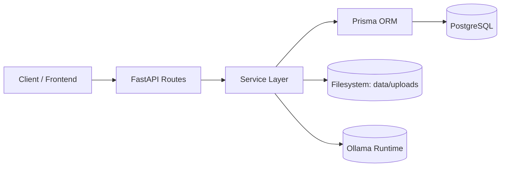

### Processing-aware architecture

```mermaid
flowchart LR
    Client --> API
    API --> Processing[Processing Routes (/api/processing)]
    Processing --> Orchestrator[Medical Processing Service]
    Orchestrator --> OCR[OCR Service]
    Orchestrator --> Presc[Prescription Analysis Service]
    Orchestrator --> Xray[X-ray Analysis Service]
    Orchestrator --> AIService[AI / Model Service]
    OCR --> FS
    Presc --> FS
    Xray --> FS
    AIService --> Ollama[(Ollama: qwen2.5, llama3.2-vision)]
    Orchestrator --> Prisma
    Prisma --> DB
```

### RAG-aware architecture

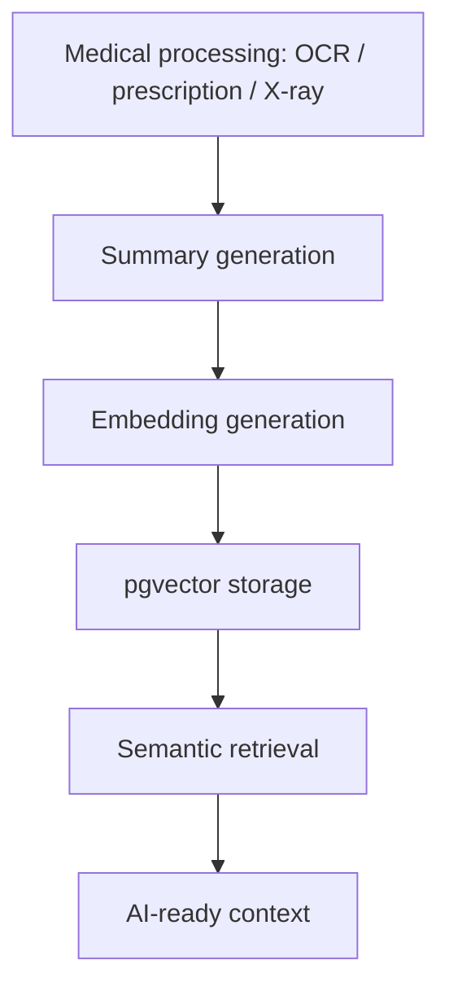

### Architectural principles

- **Routes stay thin** and only handle request/response plumbing
- **Services contain business logic** and access checks
- **Prisma handles relational data** and schema consistency
- **Files live on disk**, while metadata stays in the database
- **Authorization is checked before any sensitive operation**
- **RAG is a service-layer pipeline** with explicit summary, embedding, storage, and retrieval steps
- **Summaries are embedded instead of raw chats** so the memory layer stays compact, normalized, and clinically relevant

> [!TIP]
> This separation keeps future OCR and AI ingestion work isolated from core clinical CRUD logic.

## Local AI Architecture

DocTalk now uses a fully local AI stack so the backend can run without cloud dependencies.

### Current local models

| Purpose | Model |
|---|---|
| Reasoning, chat, summaries, OCR reasoning, RAG-grounded responses, prescription analysis | `qwen2.5:7b-instruct` |
| Embeddings and semantic retrieval | `nomic-embed-text` |
| Vision and X-ray analysis | `llama3.2-vision` |

### Why local-first was chosen

- Keeps the backend usable offline or in restricted networks
- Removes cloud API dependency from the clinical reasoning path
- Improves privacy for patient data and medical context
- Fits a solo-project deployment model without operational overhead

### Design principle

- Embeddings stay separate from reasoning so retrieval can remain cheap and stable
- Vision is isolated so image workloads do not interfere with text reasoning
- Only one heavy model should be active at a time to stay within RTX 4050 6GB limits

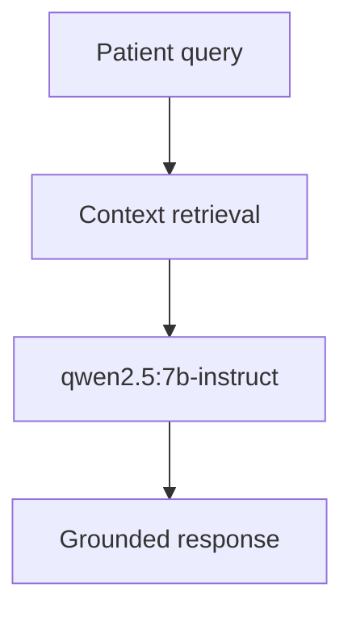

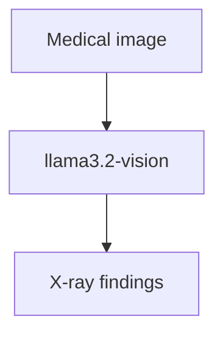

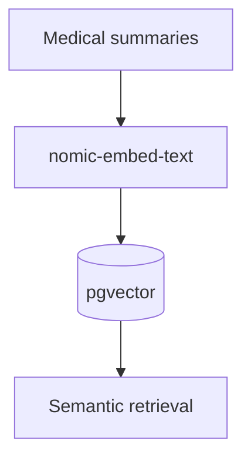

## Ollama Integration

Ollama is the runtime provider for all local model calls.

### Integration shape

- The AI service calls Ollama directly over HTTP
- Chat and reasoning requests use the chat endpoint
- Vision requests are routed only for image analysis
- Embeddings are generated separately through the embedding service
- Fallbacks remain in place if Ollama is unavailable or a model is missing

### Runtime behavior

- Reuses a single async HTTP client for local inference
- Applies short `keep_alive` values to reduce VRAM residency
- Uses low-context defaults to keep memory usage predictable
- Handles malformed JSON, load failures, and timeouts with safe fallbacks

## Local Model Routing

The backend routes each workload to the smallest acceptable model for the job.

| Task | Model |
|---|---|
| Consultation reasoning | `qwen2.5:7b-instruct` |
| Summaries and retrieval-grounded responses | `qwen2.5:7b-instruct` |
| OCR reasoning | `qwen2.5:7b-instruct` |
| Prescription analysis | `qwen2.5:7b-instruct` |
| X-ray and image analysis | `llama3.2-vision` |
| Semantic embeddings | `nomic-embed-text` |

### Routing rule

- Text tasks go to `qwen2.5:7b-instruct`
- Image tasks go only to `llama3.2-vision`
- Embeddings never share the reasoning model path
- The routing keeps one heavy model active at a time whenever possible

## VRAM Optimization Strategy

The local stack is tuned for an RTX 4050 6GB and 16GB RAM system.

### Practical constraints

- Avoid keeping qwen and vision models resident together
- Prefer short-lived vision calls for X-ray workloads
- Keep embedding generation lightweight and isolated
- Limit context size so model prompts stay stable under GPU memory pressure

### Implementation choices

- Short keep-alive for the vision model
- Conservative context and output token defaults
- Reuse the same HTTP client instead of spawning separate model clients
- Fall back to deterministic local outputs if a model cannot load in time

## Offline-First Healthcare AI

This backend is now usable as an offline-capable healthcare AI system.

### Why this matters

- Clinical review should not depend on an external API being online
- Local inference is more predictable for a solo deployment
- Offline retrieval and summaries still work when the provider is unavailable
- The system degrades safely instead of breaking the request path

### What still depends on infrastructure

- PostgreSQL and pgvector must still be available
- Ollama must be running locally for live inference
- File uploads still require the local filesystem

## Local RAG Pipeline

The RAG layer remains the same architecture, but the AI consumer is now fully local.

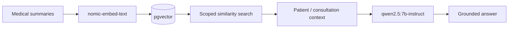

### Why embeddings are separated from reasoning

- Keeps retrieval fast and inexpensive
- Avoids loading the reasoning model just to index or search memory
- Makes the semantic layer independent from the text generation layer
- Improves stability on limited VRAM hardware

### Why the vision model is isolated

- X-ray analysis is the only workload that needs the vision model
- Keeping it separate avoids unnecessary GPU memory pressure on text tasks
- It reduces model switching cost for the common chat and retrieval path

---

## 5) Folder Structure

### Backend layout

```text
backend/
├── api/
│   ├── auth/
│   ├── appointments/
│   ├── chat/
│   ├── doctor/
│   ├── patient/
│   ├── reports/
│   ├── prescriptions/
│   ├── medical_images/
│   └── processing/          # Stage 6: OCR, prescription, x-ray analysis routes
├── core/
├── middleware/
├── services/
│   ├── ocr_service.py
│   ├── prescription_analysis_service.py
│   ├── xray_analysis_service.py
│   └── medical_processing_service.py
├── utils/
├── main.py
└── backend.md
```

### Supporting project structure

```text
prisma/
└── schema.prisma

data/
└── uploads/

docker-compose.yml
requirements.txt
.env
```

---

## 6) Request Flow

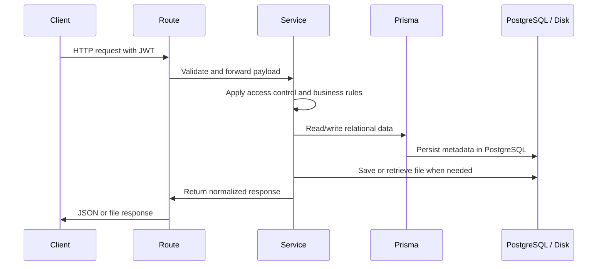

### In practice

1. The client sends a JWT-protected request
2. FastAPI route extracts the authenticated user
3. Service layer validates ownership and role constraints
4. Prisma reads or writes relational records
5. Filesystem operations run only for upload/download/delete paths
6. The response is returned in a normalized API format

### RAG request flow

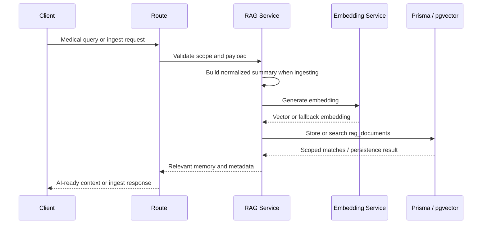

---

## 7) Authentication Flow

DocTalk uses JWT bearer tokens with role claims.

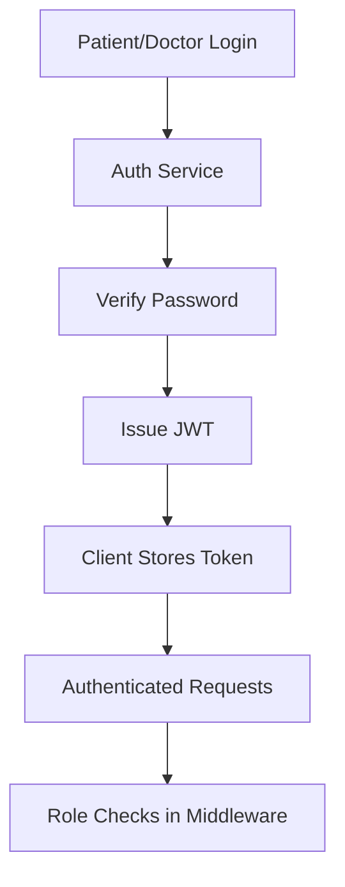

### Auth design

- Passwords are hashed with bcrypt
- JWT tokens carry user identity and role
- Middleware resolves the current user from the bearer token
- Route dependencies enforce patient-only or doctor-only access where required

| Role | Typical access |
|---|---|
| Patient | Own profile, appointments, consultations, uploaded assets |
| Doctor | Own profile, appointments, consultations, shared assets |

---

## 8) Consultation & Messaging Architecture

Consultations are relational threads created from appointments. Messaging is scoped to a consultation, which keeps the communication model simple and auditable.

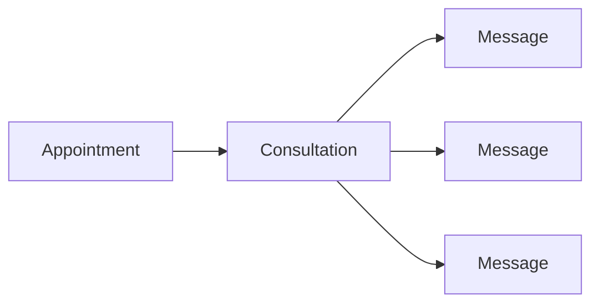

### How it works

- A consultation is created from an existing appointment
- The consultation is linked to a single patient and doctor
- Messages are stored with sender identity and role
- Access is limited to the assigned patient or doctor
- Message history supports pagination

### Why this model works

- Easy to reason about
- Suitable for solo-project scale
- Cleanly upgradeable to notifications, attachments, or future AI summaries

---

## 9) Medical Asset Architecture

Stage 5 introduced a secure file workflow for medical assets.

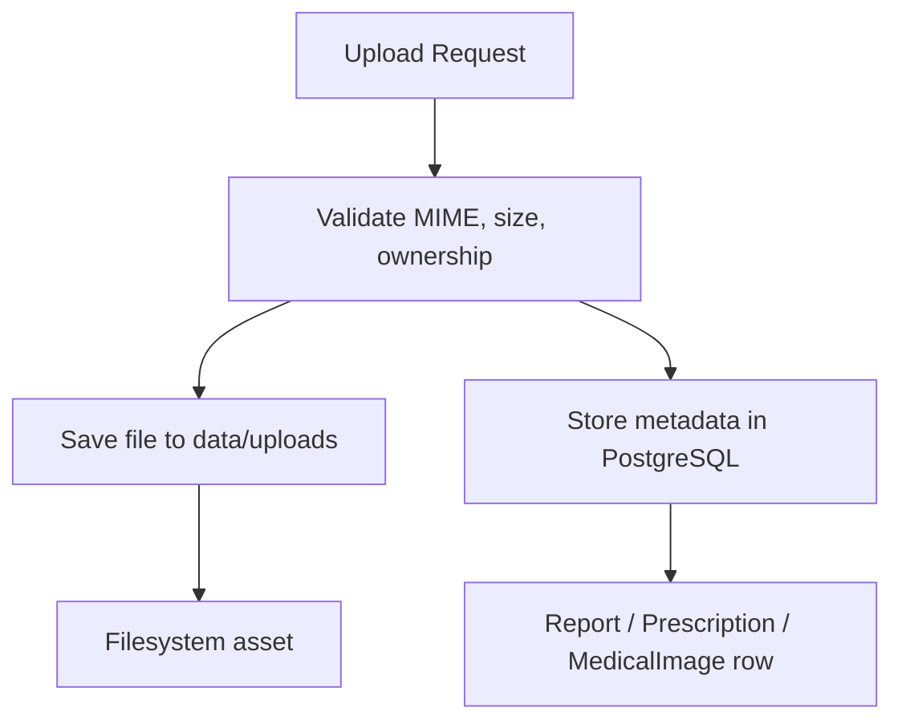

### Asset types

| Asset | Purpose | Typical upload source |
|---|---|---|
| Report | Lab results, scans, clinical PDFs | Patient or doctor |
| Prescription | Prescription documents | Doctor |
| Medical image | X-rays, images, visual diagnostics | Patient or doctor |

### Stored metadata

- patient_id
- uploaded_by
- consultation_id (optional)
- file_type
- original_name
- stored_path
- mime_type
- file_size
- timestamps

### Storage strategy

- Files are stored under `data/uploads`
- PostgreSQL stores only file metadata and relationships
- Download endpoints resolve the file path from metadata
- Delete endpoints remove both the database record and the physical file

> [!IMPORTANT]
> This is a metadata-plus-filesystem architecture, not a blob-in-database design. That keeps it simple and scalable.

## Medical Processing Architecture

The medical processing layer routes extracted content into the local AI stack and then into RAG memory.

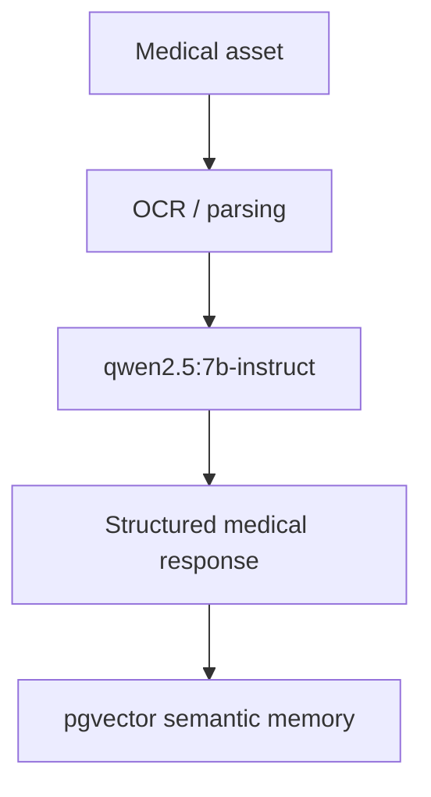

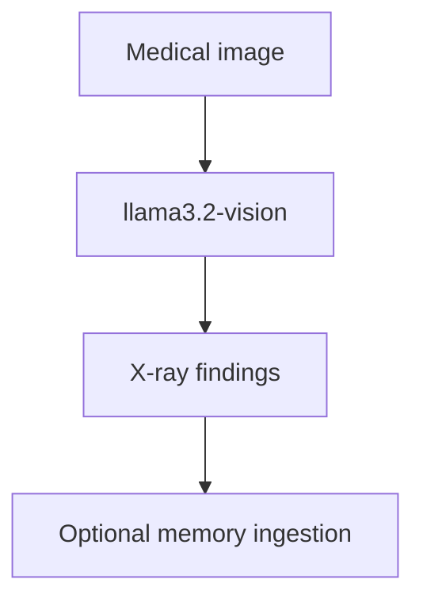

### Processing notes

- OCR and prescription workflows use the text reasoning model
- X-ray analysis uses the vision model only
- Output is normalized before ingestion into semantic memory
- The design keeps the processing chain deterministic and service-driven

---

## RAG Architecture

Stage 8 adds a lightweight semantic memory layer on top of the existing medical asset and consultation system.

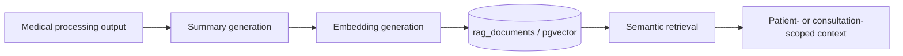

### Why this shape works

- Keeps retrieval separate from the canonical relational record
- Produces compact, normalized medical summaries instead of embedding raw chats or raw OCR text
- Makes retrieval deterministic enough for a solo-project backend while still being AI-ready
- Preserves the original source data in PostgreSQL and the filesystem

> [!NOTE]
> RAG here is a memory layer, not a replacement for consultations, assets, or structured medical records.

### Local-first behavior

- Retrieval is local through PostgreSQL and pgvector
- Embedding generation is local through Ollama
- The result is a retrieval stack that can work without any external AI service

---

## Semantic Medical Memory

Semantic memory stores compact medical summaries with embeddings so the backend can retrieve clinically relevant context later without replaying the full source document.

### Stored memory shape

- `rag_documents.id` — primary key
- `patient_id` — owning patient, required
- `consultation_id` — optional consultation scope
- `source_type` — report, prescription, xray, consultation summary, or manual ingest
- `content` — normalized text used for retrieval
- `summary` — short AI-ready summary
- `embedding` — pgvector vector persisted in PostgreSQL
- `metadata` — JSONB for filtering and traceability

### Why summaries are embedded

- Raw OCR and chat text is noisy, repetitive, and often too large for useful similarity search
- Summaries capture the medically relevant signal in a smaller, more stable representation
- The summary step lets the AI clean up formatting before retrieval while keeping provenance in `metadata`

### Fallback behavior

- If the embedding provider fails, the backend uses a deterministic fallback embedding
- If ingestion cannot produce a safe summary, the service can skip or normalize the record rather than storing malformed memory
- Retrieval still works with the stored vector or fallback vector, but the source metadata remains scoped to the patient

---

## Automatic Medical Ingestion Pipeline

The medical processing service now seeds the memory layer automatically after successful OCR, prescription, or X-ray analysis.

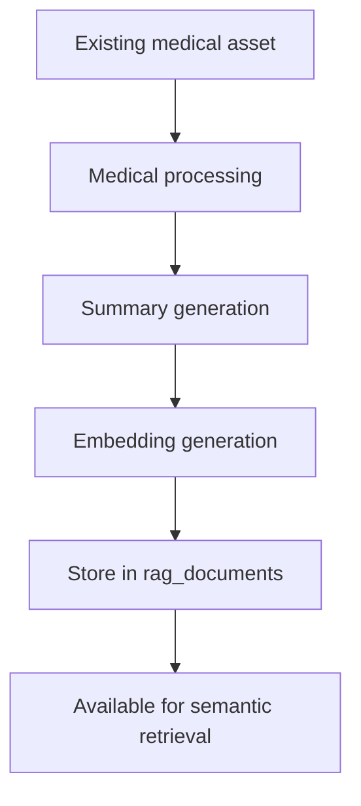

### How automatic ingestion works

1. An existing report, prescription, or X-ray is analyzed by the processing service
2. The service builds a compact summary from the structured result
3. The embedding service converts that summary into a vector
4. The RAG service stores the document in `rag_documents`
5. Duplicate-safe ingestion prevents repeated inserts for the same normalized content

### Why this is useful

- No extra manual indexing step is required after analysis
- The backend gets memory coverage immediately after OCR or model-based parsing completes
- The original asset remains the source of truth; the RAG layer only stores a retrieval-friendly derivative

---

## Embedding Generation Pipeline

The embedding layer is intentionally small and predictable.

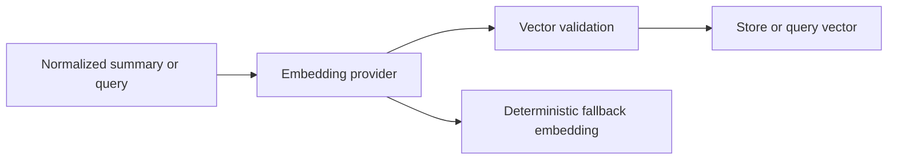

### Design notes

- The embedding service accepts a normalized summary or query string
- It tries the configured AI embedding provider first
- If the provider is unavailable, it falls back to a deterministic local vector
- Vector dimensions are validated before persistence so malformed data does not enter PostgreSQL

---

## pgvector Integration

PostgreSQL with pgvector is used as the storage and retrieval engine for semantic memory.

### Why pgvector instead of FAISS

- Keeps relational metadata and vector search in the same database
- Avoids a second persistence system for a small backend
- Makes patient isolation, consultation filtering, and source tracking easier to enforce in SQL
- Fits the existing Prisma-centered architecture without adding a separate index service

### Persistence strategy

- Vectors are stored directly in `rag_documents.embedding`
- Metadata stays in `rag_documents.metadata` as JSONB
- The original normalized text is kept alongside the vector for explainability and fallback retrieval
- The schema stays compact and easy to migrate

> [!TIP]
> For this project, pgvector gives enough retrieval quality without introducing the operational overhead of a separate vector store.

---

## Semantic Retrieval Pipeline

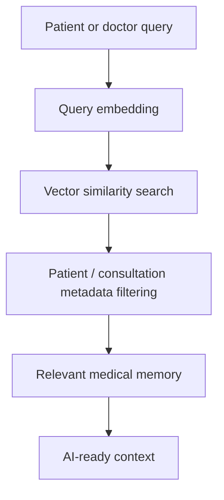

### Retrieval safeguards

- Search is always scoped to the authenticated patient or permitted doctor scope
- Consultation-scoped retrieval only returns rows linked to that consultation when requested
- Metadata filters run alongside vector similarity, not after the fact
- Duplicate documents are skipped during ingestion so repeated analysis does not inflate retrieval noise

### Context assembly

- The retriever returns concise, relevant memory items
- The calling service can feed those items into a later AI prompt or medical workflow
- This keeps generation separate from retrieval and makes the system easier to reason about

---

## Patient Isolation & Metadata Filtering

Healthcare retrieval must never cross patient boundaries, even when two summaries look semantically similar.

### Isolation rules

- Every RAG document belongs to exactly one patient
- Optional consultation scope further narrows access when a workflow is consultation-specific
- Metadata filtering ensures the database only returns documents from the authorized scope
- Service-layer checks prevent a query from escaping its allowed patient or consultation context

### Why metadata filtering is critical

- Semantic similarity alone is not sufficient in healthcare
- Two patients can share similar symptoms, medications, or report language
- Without metadata filtering, a vector search could leak another patient’s memory
- Combining vector search with relational scoping keeps retrieval clinically safe and predictable

---

## Context-Aware Medical Retrieval

The retrieval layer is consultation-aware, which means it can return memory that is relevant to the current visit instead of only the broad patient history.

### Supported scopes

- Patient-wide memory for longitudinal context
- Consultation-specific memory for active visit support
- Source-aware retrieval for reports, prescriptions, X-rays, or consultation summaries

### Practical outcome

- A doctor can search the patient’s memory and see relevant prior medical context
- A patient-scoped lookup can surface medication or report history without exposing another user’s records
- The result set is small enough to be useful in downstream prompts

---

## 10) Database Design Overview

Prisma is the source of truth for backend schema design.

### Core relational entities

| Model | Purpose |
|---|---|
| Patient | Patient identity and clinical profile |
| Doctor | Doctor identity and profile |
| Appointment | Scheduling and medical visit state |
| Consultation | Appointment-linked communication thread |
| Message | Consultation chat message |
| Report | Medical report metadata |
| Prescription | Prescription metadata |
| MedicalImage | X-ray/image metadata |
| RagDocument | Semantic medical memory with pgvector embedding |

### Design notes

- Appointments connect patients and doctors
- Consultations are unique per appointment
- Messages belong to consultations
- Medical asset tables store ownership and optional consultation linkage
- RagDocument stores patient-scoped semantic memory with optional consultation linkage
- Consultation-aware retrieval uses the same relational keys as the rest of the backend
- Data is normalized enough for clarity, but not over-modeled for a solo project

---

## 11) Security Design

Security is built into the backend rather than added as an afterthought.

### Security controls

- JWT authentication for protected requests
- Role-based route gating
- Ownership validation on consultations and file assets
- MIME type and extension validation for uploads
- File size limits for uploaded assets
- Unauthorized access returns `403 Forbidden`
- Patient isolation is enforced at the service layer for RAG queries
- Retrieval uses metadata filtering so semantic search cannot cross patient boundaries
- Consultation-scoped memory is only returned when the consultation relationship is valid

### Access rule summary

| Resource | Who can access |
|---|---|
| Patient profile | The patient, or doctor where explicitly allowed |
| Doctor profile | The doctor |
| Consultation | Assigned patient and doctor only |
| Medical files | Assigned patient or linked doctor |

### File safety model

- Reject missing files
- Reject unsupported file types
- Reject oversized uploads
- Reject uploads for another patient
- Reject downloads from unauthorized users

### RAG safety model

- Reject searches outside the authenticated patient scope
- Reject consultation-scoped searches when the consultation does not belong to the requester
- Skip or normalize malformed embeddings rather than persisting unsafe vectors
- Keep the canonical clinical record separate from semantic memory

---

## 12) API Structure

The API is grouped by domain and intentionally kept shallow.

```text
/api/auth
/api/patient
/api/doctor
/api/appointments
/api/chat
/api/reports
/api/prescriptions
/api/medical_images
 /api/processing
```

### Example endpoint categories

| Domain | Examples |
|---|---|
| Auth | signup, login, profile lookup |
| Appointments | create, approve, cancel, history |
| Chat | create consultation, list consultations, send messages, fetch history |
| Reports | upload, list, metadata, download, delete |
| Prescriptions | upload, list, metadata, download, delete |
| Medical images | upload, list, metadata, download, delete |

---

## 13) Technologies Used

| Technology | Purpose |
|---|---|
| FastAPI | HTTP API framework |
| Prisma | ORM and relational schema management |
| PostgreSQL | Primary persistent data store |
| Docker | Local database environment |
| JWT | Authentication and authorization |
| bcrypt | Password hashing |
| python-multipart | Multipart file uploads |
| Pillow / PyMuPDF | Supporting future document and image workflows |
| Ollama | Local runtime for text, vision, and embeddings models |
| pgvector | Vector storage and semantic search in PostgreSQL |

---

## 14) Deployment Notes

DocTalk is deployed as a local-first healthcare AI backend rather than a cloud-LLM service.

### Runtime requirements

- RTX 4050 6GB GPU for local inference
- 16GB RAM
- PostgreSQL with pgvector enabled
- Ollama running locally with the required models pulled

### Required models

- `qwen2.5:7b-instruct`
- `llama3.2-vision`
- `nomic-embed-text`

### Deployment guidance

- Run only one heavy model at a time when possible
- Keep the vision model short-lived
- Prefer local execution over cloud fallbacks for consistent privacy and cost control
- Use the existing fallback responses as a safety net, not as the primary runtime path

---

## 15) Future Roadmap

The backend is intentionally structured to support future expansion without rewriting the core system.

### Near-term roadmap

- Rich file previews
- Async processing for larger assets
- Better audit logging
- Deeper document search over semantic memory
- Notification hooks for doctors and patients
- Improve summary quality and retrieval ranking tuning

### Longer-term roadmap

- Stage 8 RAG foundation is complete and now powers patient-scoped semantic memory
- Future LangGraph workflows can orchestrate retrieval, summarization, and controlled follow-up actions
- AI-assisted summarization of consultations
- Physician-facing review tools
- Stage 6 and Stage 8 together prepare the backend for structured AI workflows without introducing agentic complexity

---

## 16) Future LangGraph Integration

LangGraph is intentionally deferred until the retrieval and memory layers are stable. The current Stage 8 design already provides the building blocks LangGraph would need later.

### Intended flow

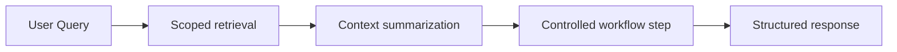

### Planned scope

- Route only after the RAG service has produced a scoped context bundle
- Keep patient-specific retrieval isolated and permission aware
- Use retrieval as an explicit step, not a hidden side effect
- Add controlled branches for follow-up questions or document-specific workflows

> [!NOTE]
> LangGraph should orchestrate the existing service boundaries, not replace them.

## 17) Development Philosophy

DocTalk follows a simple and professional development philosophy:

- Keep the backend understandable at a glance
- Prefer explicit relational data over hidden state
- Write services that can be tested independently
- Avoid unnecessary abstraction until it proves useful
- Build future AI capability on top of a stable clinical foundation

This keeps the project realistic, reviewable, and easy to extend.

---

## 18) Scalability Considerations

The current backend is designed for solo-project scale, but it remains scalable in the right ways.

### What already scales well

- Relational schema with Prisma
- File storage separated from metadata
- Clear service boundaries
- Easy route extension by domain
- Consultation-linked communication model

### What can be improved later

- Background jobs for file parsing
- Object storage instead of local disk
- Search indexing for documents
- Async AI workflows
- Audit trails and event logs

---

## 19) Future Production Improvements

Before production use, the backend would benefit from:

- Object storage for medical files
- Virus scanning for uploads
- Comprehensive audit logging
- Rate limiting on public endpoints
- Background job queue for OCR and parsing
- Structured observability and tracing
- Backups and disaster recovery strategy
- Environment-specific secrets management

> [!TIP]
> None of these are required to make the current backend understandable or reviewable. They are natural production hardening steps for a later phase.

---

## Startup Instructions

### Local development

```powershell
cd D:\DocTalk
.\.venv\Scripts\Activate.ps1
python -m uvicorn backend.main:app --reload --host 127.0.0.1 --port 8000
```

### Prisma commands

```powershell
npx prisma generate
npx prisma db push
```

### Docker database commands

```powershell
docker compose up -d
docker compose logs -f
```

### Development workflow

1. Update schema or backend services
2. Run `npx prisma generate`
3. Run `npx prisma db push`
4. Start FastAPI locally
5. Validate the affected route with a small smoke test
6. Confirm role-based access and data persistence

---

## Summary

DocTalk’s backend is now a clean relational healthcare foundation with:

- secure authentication
- appointment and consultation workflows
- secure messaging
- robust medical asset management
- Prisma-backed metadata storage
- filesystem-based binary storage
- a practical path to future AI integration

It is intentionally simple, professional, and well-positioned for OCR, RAG, and agentic features in later phases.