# DocTalk Backend Architecture

DocTalk is a modular healthcare backend that combines FastAPI, Prisma, PostgreSQL, local Ollama AI, LangGraph workflow orchestration, and controlled clinical assistance capabilities.

---

## 1) Project Overview

DocTalk supports secure patient-doctor consultations, appointment management, medical asset handling, contextual retrieval, and clinician-facing assistive workflows.

### Core capabilities

- Patient and doctor accounts with JWT authentication
- Appointment, consultation, and message management
- Secure upload, metadata, and file storage for reports, prescriptions, and medical images
- Local AI routing for text, vision, and embeddings
- Semantic memory and RAG retrieval with pgvector
- Deterministic workflow coordination for medical processing and clinician review
- Doctor copilot outputs with explainability and patient scope enforcement

### Architecture goals

| Goal | Description |
|---|---|
| Security | Protect records with role-aware access control and patient isolation |
| Clarity | Keep routes thin and move logic into services |
| Reliability | Use Prisma/PostgreSQL as the source of truth |
| Extendibility | Support OCR, RAG, AI workflows, and controlled review assistance |
| Observability | Make workflow and retrieval behavior visible and auditable |

---

## 2) High-Level Architecture

The architecture separates request handling, service logic, workflows, AI grounding, semantic memory, and asset storage.

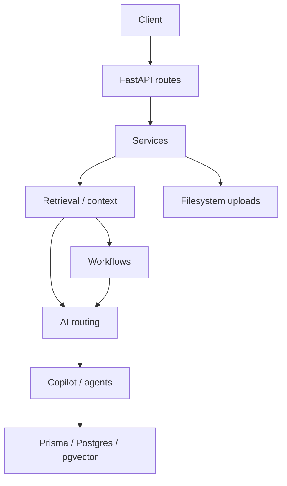
### Architecture summary

- **FastAPI**: handles authentication, authorization, request validation, and routing.
- **Services**: host business logic, database access, storage access, retrieval requests, and coordinate context building.
- **Retrieval & context**: services invoke retrieval and the `context_builder_service` to normalize memory and produce prompt-safe context used by workflows and AI.
- **Workflows (LangGraph)**: deterministic orchestration that consumes retrieval output, sequences steps, and exposes step-level visibility and retries.
- **AI routing**: AI consumes retrieval-assembled context; both retrieval and workflows feed AI routing depending on the task.
- **Copilot / agents**: consume contextual memory and retrieval outputs to produce clinician-facing support while preserving provenance and authorization.
- **Storage**: filesystem uploads are parallel infrastructure accessed directly by services for binary objects; metadata and vectors remain in PostgreSQL/pgvector.

### End-to-end request flow

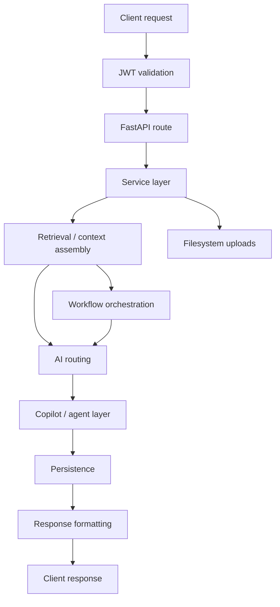

---

## 3) Core Backend Architecture

### Request path

- Routes validate JWTs, enforce role and ownership checks, and dispatch service calls
- Services coordinate database access, retrieval, AI queries, and persistence
- Workflows orchestrate multi-step medical pipelines when ordered processing is required
- Failures are contained and surfaced as structured, safe responses where possible

### Service boundaries

- Services contain validation, retrieval, AI prompt construction, and persistence logic
- Workflows coordinate service calls, retries, and step visibility
- Agents provide narrow medical reasoning without owning persistence or authorization
- AI routing is centralized in the AI service to keep model selection consistent

### Component layout

- `api` — FastAPI route modules for auth, patients, doctors, appointments, chat, assets, and processing
- `services` — business logic for AI, retrieval, medical processing, and storage, including Prisma data access
- `workflows` — LangGraph graphs for multi-step tasks such as consultation review and copilot generation
- `data/uploads` — binary file storage for medical assets
- `backend.md` — architecture documentation

---

## 4) Database Architecture

DocTalk uses Prisma as the schema and query layer on PostgreSQL. `rag_documents` stores semantic memory with pgvector embeddings.

- Prisma provides a typed client and schema-driven database model for relational and vector access.
- PostgreSQL stores patient, consultation, and asset data while pgvector enables similarity search in the same system.
- JSONB metadata supports flexible provenance, patient/consultation scoping, and retrieval filters without schema churn.
- RagDocument ownership is enforced by `patient_id` and optional `consultation_id` to keep retrieved context bounded.
- Consultation-linked retrieval preserves visit-specific history and medical context for AI grounding.
- Metadata-filtered vector search combines semantic similarity with explicit access controls to prevent cross-patient leakage.

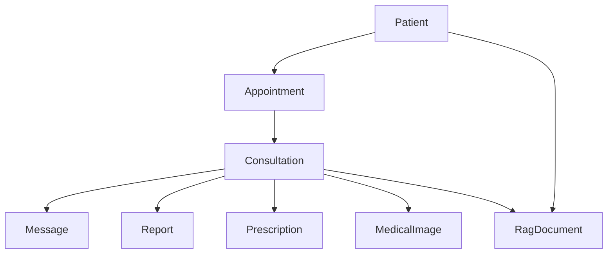

## Database schema (Prisma models)

The Prisma schema in `prisma/schema.prisma` defines the authoritative relational model. The following concise reference maps the primary models, keys, relations, and notable column types used by the backend:

- `Patient` (table `patients`):
    - Primary key: `username` (String)
    - Fields: profile data, `publicKey` / `encryptedPrivateKey`, timestamps
    - JSONB columns: `closedDoctorChats`, `doctorChats`, `chatSessions`, `xrayAnalyses`, `customAssets` for extensible session/state data
    - Relations: `appointments`, `consultations`, `ragDocuments`, `reports`, `prescriptions`, `medicalImages`, `fileKeys`

- `Doctor` (table `doctors`):
    - Primary key: `doctorId` (String)
    - Fields: profile, `role` (enum), `registrationNumber`, `hospitalName`, timestamps
    - JSONB columns: `schedules`, `appointmentRequests`, `payments`, `patientChats`, `assistantChat`, `closedChats`
    - Relations: `appointments`, `consultations`, `fileKeys`

- `Appointment` (table `appointments`):
    - Primary key: `id` (String)
    - FKs: `patientUsername` -> `Patient.username`, `doctorId` -> `Doctor.doctorId` (indexed)
    - Fields: `date`, `time`, `scheduledTime`, `reason`, `status` (enum `AppointmentStatus`), timestamps
    - Optional relation to `Consultation`

- `Consultation` (table `consultations`):
    - Primary key: `id` (uuid)
    - Unique `appointmentId` -> `Appointment.id`
    - FKs: `patientUsername`, `doctorId` (both indexed)
    - Relations: `messages`, `reports`, `prescriptions`, `medicalImages`, `ragDocuments`
    - `lastMessageAt` and timestamps support timeline queries

- `Message` (table `messages`):
    - Primary key: `id` (uuid)
    - FK: `consultationId` -> `Consultation.id` (indexed)
    - Fields: `senderId`, `senderRole` (enum), `message` (text), `timestamp`
    - Indexes: `(consultationId, timestamp)`, `senderId`

- `FileKey` (table `file_keys`):
    - Primary key: `id` (uuid)
    - Fields: `fileId`, optional `patientUsername` or `doctorId`, `encryptedFileKey`, timestamp
    - Relations to `Patient` and `Doctor` for file ownership

- `Report`, `Prescription`, `MedicalImage` (tables `reports`, `prescriptions`, `medical_images`):
    - Primary key: `id` (uuid)
    - FKs: `patientUsername`, optional `consultationId` (SetNull on delete)
    - Fields: uploader metadata (`uploadedBy`, `uploadedByRole`), `fileType`, `originalName`, `storedPath`, `mimeType`, `fileSize`, timestamps
    - Indexes: `patientUsername`, `uploadedBy`, `consultationId` for efficient listings and ownership checks

- `RagDocument` (table `rag_documents`):
    - Primary key: `id` (uuid)
    - Fields: `patient_id` (mapped to `patientId`), optional `consultation_id` (mapped to `consultationId`), `source_type`, `content`, `summary`, `embedding`, `metadata` (JSONB), `created_at`
    - `embedding` column: defined as `Unsupported("vector")` in Prisma and backed by `pgvector` extension in Postgres
    - Indexes: `patientId`, `consultationId`, `sourceType` to support scoped retrieval and filtering
    - Relations: `patient`, optional `consultation`

Notes:
- Vector storage: `RagDocument.embedding` uses `pgvector` in Postgres; application queries combine vector similarity with JSONB metadata filters to enforce patient/consultation scoping.
- JSONB usage: several models use `Json`/@db.JsonB to store structured, evolving session and state data without frequent migrations.
- Indexing: foreign keys, status fields, and timestamps are explicitly indexed in the schema to support efficient retrieval and timeline queries.

### Core entities

- `Patient` — patient identity and clinical profile
- `Doctor` — doctor identity and profile
- `Appointment` — scheduling and visit metadata
- `Consultation` — appointment-linked communication thread
- `Message` — consultation chat messages
- `Report` — report metadata and file references
- `Prescription` — prescription metadata and file references
- `MedicalImage` — X-ray/image metadata and file references
- `RagDocument` — semantic memory row with embedding and metadata

### Relationships

- Appointments connect patients and doctors
- Consultations belong to one appointment and one patient
- Messages are scoped to a consultation
- Medical assets may be linked to consultations and patients
- RAG documents belong to a patient and may optionally reference a consultation

### pgvector and semantic memory

- `rag_documents.embedding` holds pgvector embeddings in PostgreSQL
- `metadata` stores source type, patient/consultation filters, timestamps, and provenance
- `content` and `summary` preserve the original normalized text and retrieval-friendly summary
- `source_type` distinguishes report, prescription, xray, consultation summary, and manual ingest

### Metadata filtering

- All retrieval queries use patient and optional consultation metadata filters
- Patient isolation is enforced before vector similarity results are returned
- Metadata filtering is combined with vector search to prevent cross-patient leakage

---

## 5) Authentication & Security

### Auth model

- JWT bearer tokens carry identity and role claims
- Route dependencies enforce patient-only and doctor-only access where required
- Passwords are hashed with bcrypt

### Access control

- Patient and doctor actions are authorized at the route and service layer
- Consultation access is limited to the assigned patient and doctor
- Medical file operations check ownership and asset linkage
- RAG queries are scoped to the authenticated patient or a permitted doctor scope

### Request safety

- Request schemas forbid extra fields and validate payload shape
- Invalid or malformed requests fail closed
- File uploads validate MIME type, size, content, and ownership
- File path resolution remains rooted under `data/uploads`

### Semantic safety

- Retrieval uses patient-scoped metadata filters in addition to vector similarity
- Consultation-scoped memory is only returned when the consultation relationship is valid
- Unsafe prompt fragments are sanitized before AI calls
- Malformed AI responses are normalized or rejected before downstream use

---

## 6) Consultation & Messaging

Consultations are relational threads created from appointments. Messages are scoped to a consultation and stored with sender role metadata.

### Consultation model

- Consultations belong to an appointment and a patient
- Doctors and patients may exchange messages within a consultation
- Message history is paginated and stored with sender identity

### Architecture

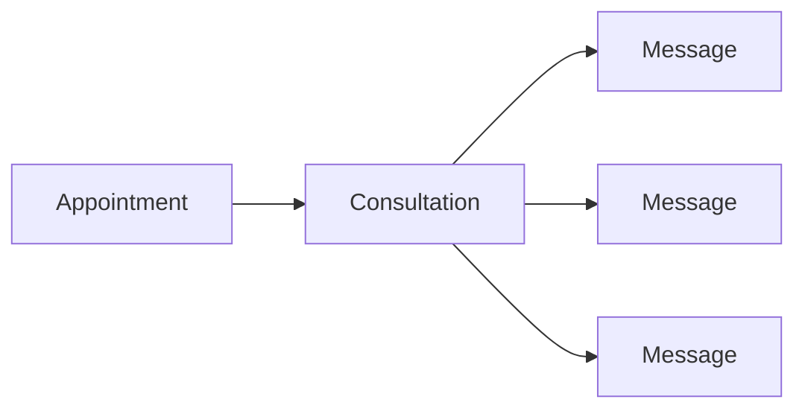

### Benefits

- Keeps communication auditable and scoped
- Supports medical contexts tied to specific visits
- Simplifies ownership checks and retrieval logic

---

## 7) Medical Asset System

Medical assets are stored as filesystem binaries with metadata in PostgreSQL.

### Asset workflow

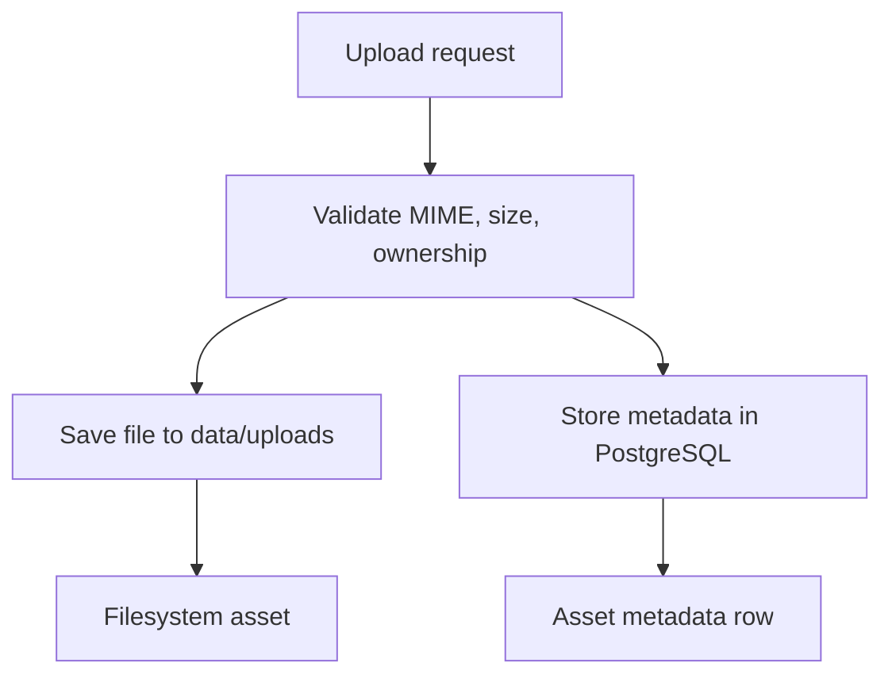

### Asset types

| Asset | Purpose |
|---|---|
| Report | Lab results, clinical PDFs |
| Prescription | Prescription documents |
| Medical image | X-rays and diagnostic images |

### Storage strategy

- Binary files reside under `data/uploads`
- PostgreSQL stores ownership, relationships, and asset metadata
- Download and delete operations resolve files from metadata and ensure authorization

---

## 8) AI Architecture

DocTalk routes AI work through a local Ollama stack for reasoning, vision, and embeddings.

### Local model mapping

| Task | Model |
|---|---|
| Reasoning, chat, summaries, RAG-grounded responses, OCR reasoning | qwen2.5:7b-instruct |
| Semantic embeddings | nomic-embed-text |
| Vision and X-ray analysis | llama3.2-vision |

### AI layering

- `embedding_service` handles embeddings
- `retrieval_service` handles vector search and metadata filters
- `context_builder_service` normalizes retrieved memory, removes duplicates, constructs prompt-safe context, and transforms retrieval output into AI-grounded prompts
- `ai_service` routes text and vision requests to the appropriate model path

### Ollama integration

- Local Ollama serves text, vision, and embedding endpoints
- A shared async client manages inference traffic
- The system prefers sequential model use to reduce concurrency pressure
- Timeouts and fallback behavior isolate model failures from the request path

### Model routing guarantees

- Embeddings are generated only by the embedding service
- Reasoning and summarization use the text model
- Vision analysis uses a separate vision model
- Copilot and assistant outputs reuse the same centralized AI and safety layer

---

## 9) RAG & Semantic Memory

RAG is implemented as a patient-scoped semantic memory layer that supports retrieval-grounded reasoning.

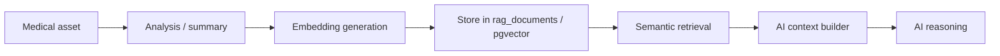

### Semantic memory shape

- `id` — primary key
- `patient_id` — required owner scope
- `consultation_id` — optional consultation scope
- `source_type` — report, prescription, xray, consultation summary, manual ingest
- `content` — normalized text for retrieval
- `summary` — compact summary used for embeddings
- `embedding` — pgvector vector
- `metadata` — JSONB for filtering and provenance

### Retrieval strategy

- Query embedding is generated locally
- pgvector search returns candidates restricted by patient/consultation metadata
- Duplicate filtering removes repeated or semantically redundant rows before prompt assembly
- Query lifecycle: embedding generation → pgvector similarity search → metadata filtering → duplicate filtering → context assembly → AI grounding
- Retrieved context is composed with provenance metadata for explainability

### Copilot and memory

- Copilot modules consume retrieved semantic memory as the primary context source
- Timeline, symptom, medication, and risk analysis operate on scoped retrieval output
- Evidence references map back to stored metadata

---

## 10) Workflow Orchestration

Workflows are deterministic graphs that sequence service calls while keeping core logic in services.

### Workflow architecture

- LangGraph coordinates retrieval, analysis, summarization, and persistence steps
- Services retain validation, database access, and AI prompt construction
- Workflows expose step visibility, retry boundaries, and error state

### Why LangGraph

Workflow orchestration provides deterministic execution order, step-level visibility, safe retry logic, and controlled medical pipeline progression without embedding orchestration in service layer or route handlers.

### Orchestration responsibilities

- Step order and conditional branches
- Safe retry and failure handling
- Workflow state and observability

### Non-responsibilities

- Workflows do not own business logic
- Workflows do not perform direct database writes outside services
- Workflows do not replace route authorization checks
- Workflows do not make autonomous medical decisions

### Example patient chat workflow

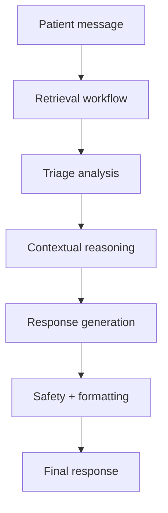

### Example report ingestion

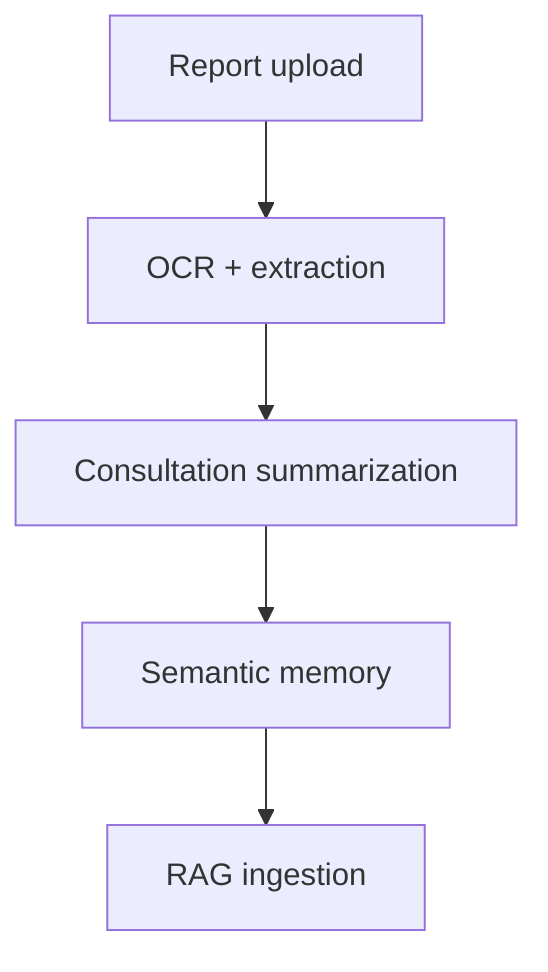

### Example X-ray workflow

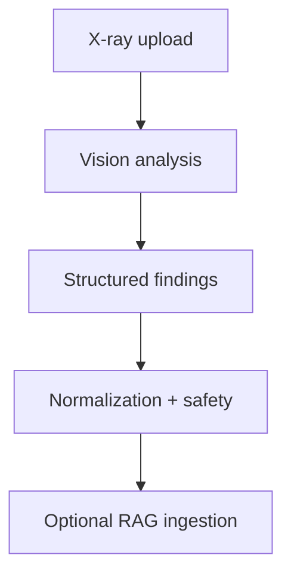

### Workflow state management

- Workflow state is minimal and transient: step status, timestamps, errors, and IDs
- Durable data remains in services and database tables
- Workflows are recoverable and auditable without duplicating business data

---

## 11) Medical Agents

Medical agents are narrow, controlled helpers invoked inside workflows.

### Agent roles

- Triage agent detects urgent symptom patterns
- Summarization agent compacts consultation text
- Doctor assistant agent prepares clinician-facing briefings

### Agent characteristics

- Agents operate on already-scoped data
- Agents return structured support outputs
- Agents do not bypass authorization or persistence controls
- Agents are deterministic wrappers around service logic

### Example agent flow

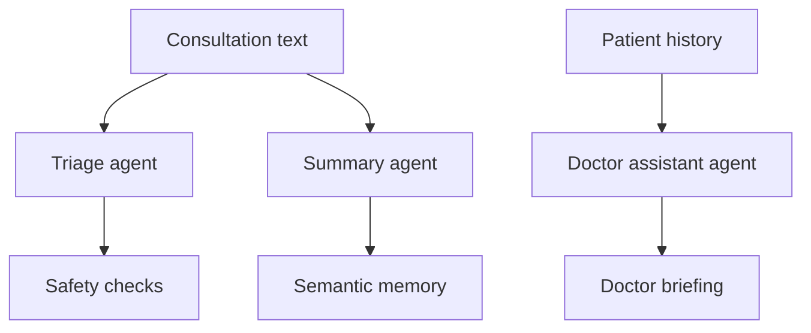

---

## 12) Doctor Copilot

Doctor copilot is a clinician-facing assistive layer that composes retrieval, timeline synthesis, risk signals, and overview generation.

### Copilot flow

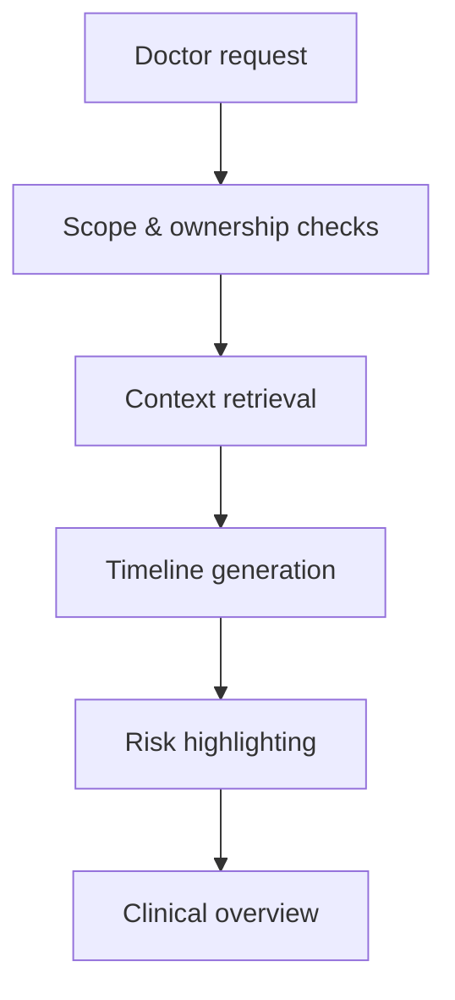

### Copilot design

- Orchestration over existing services, not a separate decision engine
- Uses patient-scoped contextual memory for insights
- Returns explainable, evidence-backed clinician outputs
- Preserves authorization and safety boundaries

### Clinical intelligence modules

- Patient overview generation
- Medical timeline system
- Symptom progression tracking
- Medication intelligence
- Clinical risk highlighting

### Explainability and safety

- Outputs include source references and timestamps
- Evidence remains scoped to authorized patient context
- Results are informational and avoid diagnostic or prescribing claims

---

## 13) API Structure

The API is grouped by domain and intentionally shallow.

```text
/api/auth
/api/patient
/api/doctor
/api/appointments
/api/chat
/api/reports
/api/prescriptions
/api/medical_images
/api/processing
```

### Endpoint categories

| Domain | Examples |
|---|---|
| Auth | signup, login, profile |
| Appointments | create, approve, cancel, history |
| Chat | create consultation, list consultations, send messages |
| Reports | upload, list, download, delete |
| Prescriptions | upload, list, download, delete |
| Medical images | upload, list, download, delete |
| Processing | OCR, prescription analysis, X-ray analysis |

---

## 14) Runtime & Deployment

### Runtime constraints

- PostgreSQL and pgvector must be available
- Ollama must be running locally for inference
- One heavy model should be active at a time where possible
- Timeouts and fallbacks protect request latency
- Retrieval context should remain compact to avoid unnecessary model pressure

### Runtime resilience

- Graceful degradation is implemented so partial inference or retrieval failures return safe fallbacks instead of unhandled errors.
- AI fallback behavior catches model errors and routes requests to degraded response paths while preserving request semantics.
- Retrieval deduplication removes repeated context before prompt assembly to reduce prompt size and improve grounding quality.
- Fail-fast workflow behavior validates preconditions early and aborts invalid paths before invoking downstream services.
- Structured recovery strategy logs transient failures, bounds retries, and commits persistence only after workflow completion.

### Deployment posture

- Operate on trusted local infrastructure
- Use Docker Compose for PostgreSQL
- Pull required Ollama models before runtime
- Keep the upload storage directory writable and backed up

---

## 15) Observability & Hardening

### Observability

- Log workflow step start, completion, and failures
- Capture retrieval and embedding behavior
- Record AI timeouts, fallback use, and malformed response handling
- Preserve structured state for troubleshooting without exposing sensitive data

### Hardening

- Validate requests early and fail closed on malformed payloads
- Enforce ownership and role checks on protected operations
- Apply metadata filters to all semantic retrieval
- Reject unauthorized access with explicit HTTP status codes
- Keep unsafe outputs out of persisted memory and downstream prompts

---

## 16) Scalability

### What scales

- Prisma relational schema and service boundaries
- Separate filesystem storage from metadata
- Workflow orchestration with explicit step graphs
- Semantic memory retrieval using PostgreSQL + pgvector

### Future improvements

- Background processing for large asset parsing
- Object storage for larger files
- Search indexing for complex retrieval scenarios
- Async AI workflows and job queues
- Structured monitoring and tracing

---

## 17) Startup Instructions

### One-click from project root

From the project root, use the startup orchestrator:

```powershell
cd D:\DocTalk
.\start_dev.bat
```

Optional modes:

```powershell
.\start_dev.bat --check
.\start_dev.bat --logs
```

What it does from root:

- Validates `.env`, `.venv`, frontend dependencies, Docker, and Prisma prerequisites
- Starts PostgreSQL from `docker-compose.yml` and waits for health
- Checks Ollama availability and required models
- Starts backend and frontend in separate terminals
- Prints readiness summary with backend/frontend URLs

### Local development

```powershell
cd D:\DocTalk
.\.venv\Scripts\Activate.ps1
python -m uvicorn backend.main:app --reload --host 127.0.0.1 --port 8000
```

### Prisma

```powershell
npx prisma generate
npx prisma db push
```

### Docker

```powershell
docker compose up -d
docker compose logs -f
```

---

## 18) Technologies

| Technology | Purpose |
|---|---|
| FastAPI | HTTP API framework |
| Prisma | ORM and schema management |
| PostgreSQL | Primary datastore |
| pgvector | Vector storage and retrieval |
| Docker | Local database runtime |
| JWT | Authentication and authorization |
| bcrypt | Password hashing |
| python-multipart | File uploads |
| Pillow / PyMuPDF | Document and image handling |
| Ollama | Local model runtime |
| LangGraph | Workflow orchestration |
| qwen2.5:7b-instruct | Text reasoning and summaries |
| llama3.2-vision | Vision and X-ray analysis |
| nomic-embed-text | Embeddings |
