# DocTalk Backend Architecture

> **DocTalk** is a modular healthcare backend built with **FastAPI**, **Prisma**, **PostgreSQL**, **Docker**, and **JWT-based security**. It combines consultation messaging, secure medical asset handling, contextual RAG, semantic medical memory, a local Ollama AI stack, LangGraph workflow orchestration, and controlled medical assistant agents in a single backend architecture.

---

## 1) Project Overview

DocTalk is a healthcare backend designed to support patient-doctor interactions, appointment scheduling, consultation messaging, secure file handling for medical documents and images, and controlled AI-assisted medical workflows. The system stays practical and production-minded without unnecessary enterprise overhead.

### What it does today

- Supports patient and doctor accounts with JWT authentication
- Manages appointments and consultation threads
- Stores medical assets such as reports, prescriptions, and medical images
- Separates file metadata in PostgreSQL from binary storage on disk
- Enforces ownership and role-based access control across protected resources
- Runs deterministic workflow graphs for consultation reasoning, report analysis, prescription processing, and X-ray analysis
- Uses controlled medical assistant agents for triage, consultation summarization, and doctor briefings
- Uses a doctor copilot layer to generate explainable clinical intelligence from contextual medical memory

### High-level intent

The backend is designed as a stable clinical data layer that feeds OCR, retrieval pipelines, local AI assistants, and physician-facing workflows without depending on cloud model providers.

### Workflow orchestration

A lightweight workflow orchestration layer (LangGraph) coordinates existing services into explicit, observable pipelines. Workflows orchestrate retrieval, context assembly, model reasoning, safety checks, and storage without moving core business logic out of services.

### Architecture goals

| Goal | Description |
|---|---|
| Safety | Keep patient-facing AI bounded by deterministic workflow steps and policy checks |
| Clarity | Keep routes thin and let services own business logic |
| Reliability | Use Prisma and PostgreSQL as the source of truth for relational data and vector-backed memory |
| Local-first operation | Route reasoning, vision, and embeddings through Ollama to reduce external dependency |
| Observability | Make workflow steps visible, testable, and auditable |

### Runtime stability emphasis

The backend now treats runtime stability as part of the architecture rather than as an operational afterthought.

- Validate requests early and fail closed on malformed payloads
- Prefer safe fallbacks over partial unsafe AI output
- Keep retrieval and context assembly scoped to the current patient or consultation
- Recover from transient Prisma and Ollama issues without forcing a full architectural restart
- Minimize prompt noise before it reaches the local model stack

---

## 2) Backend Goals

The backend is optimized around five goals:

| Goal | Description |
|---|---|
| Security | Protect patient data with authenticated, role-aware access control |
| Clarity | Keep routing thin and move logic into services |
| Reliability | Store relational data in PostgreSQL with Prisma-managed schema |
| Extensibility | Make room for OCR, RAG, and AI workflows later |
| Practicality | Keep the project realistic for a solo final-year build |

> [!NOTE]
> The current codebase focuses on a clean clinical backend foundation first. AI features are intentionally planned, not prematurely embedded into core workflows.

---

## 3) Current Backend Features

### Implemented capabilities

- FastAPI application foundation with health endpoints
- PostgreSQL database managed through Docker Compose
- Prisma ORM for schema modeling and database access
- JWT authentication for patients and doctors
- Role-based access control for protected routes
- Patient and doctor profile APIs
- Appointment creation and management
- Consultation creation linked to appointments
- Secure chat-style messaging inside consultations
- Secure upload system for medical assets
- Metadata storage in PostgreSQL and file storage under `data/uploads`
- Medical processing pipelines (OCR, prescription parsing, X-ray analysis) with standardized structured outputs
- Centralized AI/model access service backed by local Ollama runtime routing
- pgvector-backed RAG foundation for semantic medical memory and retrieval
- Automatic ingestion of structured medical processing output into patient-scoped memory
- Consultation-aware and metadata-filtered retrieval for AI-ready context assembly
- Offline-capable local AI architecture optimized for a 6GB VRAM GPU and 16GB RAM

### Medical asset types

- Reports
- Prescriptions
- Medical images / X-rays

---

## Workflow Orchestration

LangGraph is used as an orchestration layer, not as a business-logic layer. Each workflow is a small deterministic graph that sequences service calls for a single medical task.

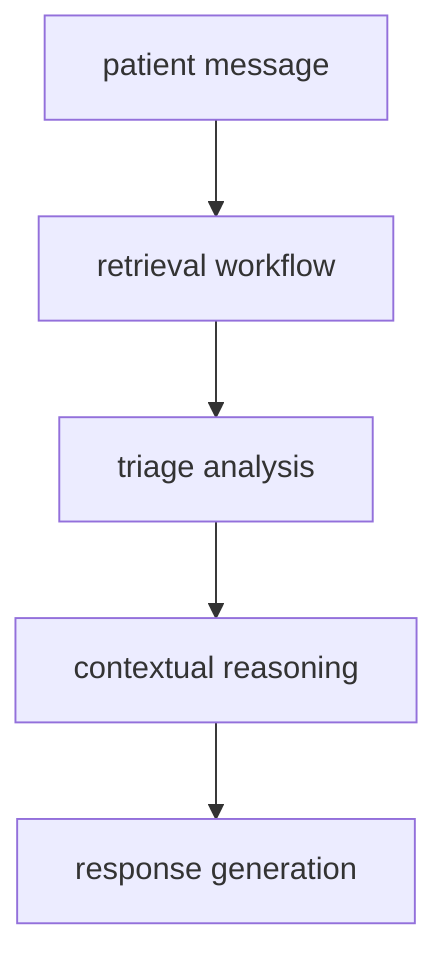

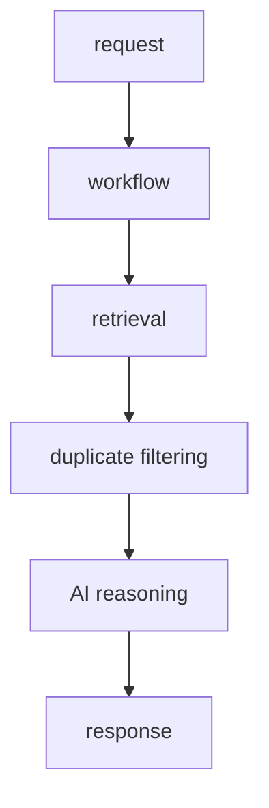

### Why workflows are orchestration-only

- The workflow layer decides order, branching, retries, and step visibility
- Services decide validation, storage, retrieval, and AI payload construction
- This keeps business rules testable without embedding them into the orchestration engine
- It also prevents the graph layer from becoming a hidden second application layer

### Workflow-agent interaction

- Workflows collect context and invoke controlled agents when a bounded medical assistant step is needed
- Agents return structured outputs only; they do not own persistence or cross-service side effects
- Services remain the canonical place for database access, file handling, and model routing
- Workflow steps fail fast when a required asset, retrieval step, or persistence operation cannot be completed safely
- Partial recovery is preferred only when the next step can still produce a safe structured response

## Runtime Stability

Runtime stability is implemented through bounded retries, safe fallbacks, request validation, and scoped error handling.

### Stability behavior

- Graceful degradation returns structured fallback responses when the Ollama stack is offline or times out
- Malformed AI responses are normalized or blocked before they can enter persistence or downstream prompts
- Retrieval failures fall back to local lexical context instead of crashing the request path
- Workflow recovery keeps the request alive only when a bounded partial response is still safe to return
- Fail-fast behavior stops workflow continuation when file loading, OCR, persistence, or asset resolution fails

### Failure recovery strategy

- Retry only the small number of steps that can safely recover from transient failure
- Keep failure localized to the step that broke instead of unwinding the whole backend
- Preserve workflow logs and error details for troubleshooting without exposing unsafe internals to clients
- Prefer structured partial output over silent corruption

### Typical orchestration patterns

- Patient message flows run retrieval, triage, reasoning, safety, and response formatting
- Consultation summaries run summary generation, semantic memory compaction, and RAG ingestion
- Doctor-facing workflows assemble a patient overview before returning a concise briefing
- Doctor copilot workflows run overview generation, timeline refresh, and explainable clinical signal composition

---

## Medical Assistant Layer

DocTalk uses controlled medical assistant agents as narrow helpers inside workflows. They are not autonomous chatbots.


### Agent design principles

- Agents are deterministic wrappers around existing services and heuristics
- Each agent returns structured medical support data, not unrestricted free-form output
- Agents run inside workflows so they inherit request scope, ownership checks, and audit logging
- Agents never bypass service-layer authorization or persistence controls

### Included agents

- Triage agent for urgency and risk classification
- Consultation summarization agent for compact clinical summaries
- Doctor assistant agent for patient briefings and review support

---

## Triage & Risk Analysis

The triage layer identifies urgent patterns early in the consultation path so the system can safely route high-risk content.

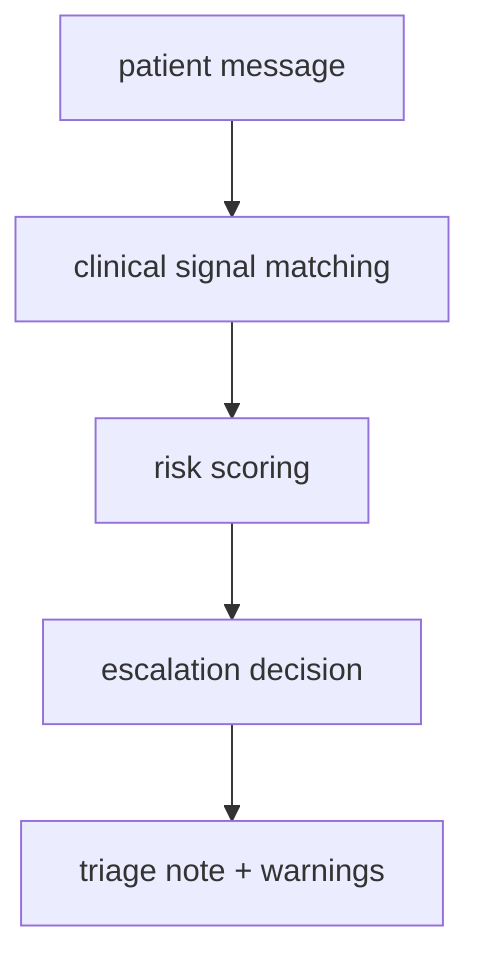

### Triage behavior

- Matches urgent symptom language and produces a bounded risk score
- Marks escalation when emergency patterns are detected
- Generates warnings that are suitable for a clinician-facing workflow, not a diagnosis
- Keeps triage deterministic so the same inputs produce the same safety output class

### Safety role

- Triage runs before deeper reasoning when the workflow needs early risk detection
- Escalation flags can influence workflow branching, response framing, or manual review
- The output is advisory only and does not replace clinical judgment

---

## Consultation Summarization

Consultation summaries compress the conversation into a compact, retrieval-friendly clinical record.

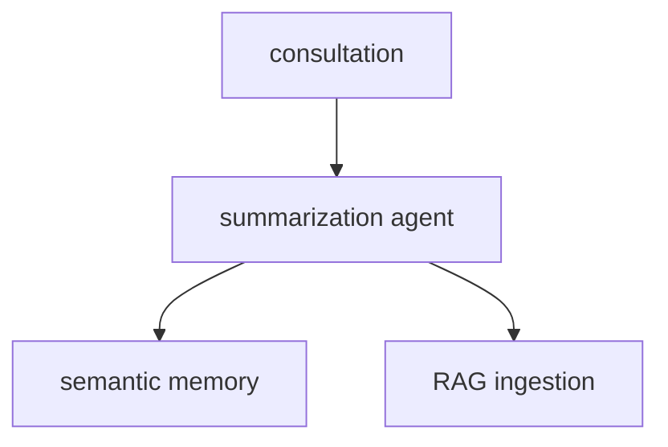

### Why summarization exists

- Full chat transcripts are too noisy for long-term retrieval
- Compact summaries keep the semantic memory layer small and useful
- Summaries make later doctor review and retrieval more stable than raw conversation replay

### Output shape

- Summary text for immediate display
- Structured findings, recommendations, warnings, and metadata
- Compact content for semantic memory and retrieval ingestion

---

## Doctor Assistance System

The doctor assistant layer builds short patient overviews before the clinician reads the full history.

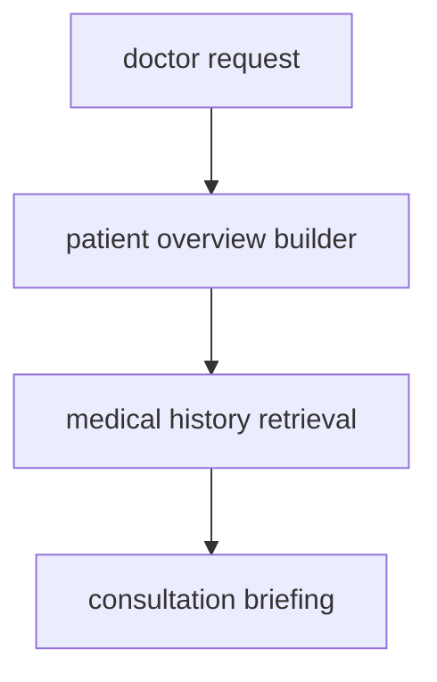

### What it does

- Pulls recent consultation context and prior findings
- Condenses the patient history into a briefing suitable for a doctor-facing workflow
- Highlights key risks, recent findings, and prior medications
- Keeps the assistant bounded to the current patient scope

### Why it matters

- Reduces the amount of manual context assembly needed before review
- Keeps the workflow deterministic while still adding useful medical assistance
- Preserves the doctor as the final decision-maker

## Doctor Copilot Architecture

The doctor copilot is a workflow-orchestrated clinical support layer that composes retrieval, timeline synthesis, risk highlighting, and concise briefing generation.

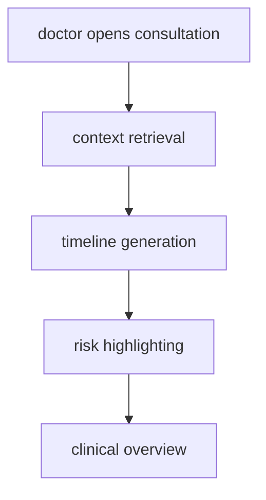

Text view: doctor opens consultation -> context retrieval -> timeline generation -> risk highlighting -> clinical overview.

### Core design

- Built as orchestration over existing services, not a separate decision engine
- Uses contextual memory and scoped retrieval as the source of insight
- Returns structured outputs designed for clinician review workflows
- Preserves existing authorization, safety, and logging boundaries

## Clinical Intelligence Layer

Clinical intelligence is implemented as focused service modules that each produce one explainable insight class.

### Included modules

- Patient overview generation
- Medical timeline system
- Symptom progression tracking
- Medication intelligence
- Clinical risk highlighting

### Why it is assistive instead of autonomous

- No diagnosis generation
- No prescription generation
- No autonomous planning loop
- Every output is informational and evidence-linked

## Patient Overview Generation

Patient overview generation provides a compact doctor-facing summary across the most recent relevant context.

### Overview contents

- Concise patient summary
- Recent consultations
- Recurring symptoms
- Medication continuity signals
- Recent report references
- Key findings with evidence

## Medical Timeline System

The medical timeline system produces chronological event views from consultations, reports, prescriptions, imaging, and workflow summaries.

### Timeline output

- Timestamped events
- Major findings
- Treatment progression snapshots
- Source references for each high-value event

## Symptom Progression Tracking

Symptom progression tracking identifies recurrence and trend signals from contextual memory.

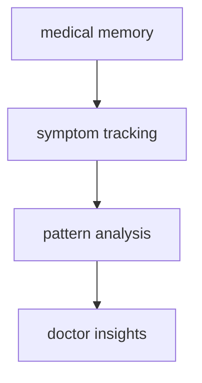

Text view: medical memory -> symptom tracking -> pattern analysis -> doctor insights.

### Tracked behavior

- Recurring symptom terms
- Worsening and improvement hints
- Chronic complaint patterns
- Repeated complaint clusters

## Medication Intelligence

Medication intelligence summarizes continuity and overlap patterns from scoped prescription history.

### Insights returned

- Repeated medications
- Continuity across recent records
- Recent medication-change signals
- Potential overlap warnings for clinician review

### Safety behavior

- Informational wording only
- No pharmaceutical claims
- No prescribing recommendations

## Explainable Clinical Assistance

Explainability is enforced by attaching evidence references to each major copilot insight.

### Explainability guarantees

- Source summaries are included in copilot outputs
- Source references are attached to findings and highlights
- Retrieved evidence keeps timestamps and source types
- Outputs avoid black-box or unsupported certainty claims

### Patient isolation in copilot outputs

- Doctor ownership checks run before copilot execution
- Retrieval remains scoped to authorized patient and consultation context
- Cross-patient evidence is blocked before insight synthesis
- Evidence payloads are derived only from authorized retrieval results

---


## RAG Architecture

RAG is a single, coherent pipeline integrated with the AI service and scoped to patient/consultation boundaries.


### Architectural principles

- **Routes stay thin** and only handle request/response plumbing
- **Services contain business logic** and access checks
- **Prisma handles relational data** and schema consistency
- **Files live on disk**, while metadata stays in the database
- **Authorization is checked before any sensitive operation**
- **RAG is a service-layer pipeline** with explicit summary, embedding, storage, and retrieval steps
- **Summaries are embedded instead of raw chats** so the memory layer stays compact, normalized, and clinically relevant
- **Workflow outputs feed RAG** so consultation summaries, report summaries, and analysis results can be stored as compact memory instead of full raw payloads

> [!TIP]
> This separation keeps OCR and AI ingestion work isolated from core clinical CRUD logic.

## Local AI Architecture

DocTalk uses a fully local AI stack so the backend can run without cloud dependencies. The provider-layer is isolated in the AI service and related embedding/retrieval services so the rest of the application remains unchanged.

### Current local models

| Purpose | Model |
|---|---|
| Reasoning, chat, summaries, RAG-grounded responses, prescription & OCR reasoning | qwen2.5:7b-instruct |
| Embeddings and semantic retrieval | nomic-embed-text |
| Vision and X-ray analysis | llama3.2-vision |

### Design principle

- Embeddings are generated by a dedicated embedding service and stored in pgvector; reasoning never reuses the embedding model path.
- Vision workloads are isolated to a vision route/service to avoid co-residency with the text model.
- The AI layer is service-oriented: `embedding_service`, `retrieval_service`, `context_builder_service`, and `ai_service` provide clear responsibilities and safe provider swaps.
- Context windows are kept compact so the local GPU is not forced to carry unnecessary prompt state.
- Only one heavy model should be active at a time when possible, which keeps local inference predictable on modest hardware.
- Doctor copilot insights use the same centralized AI and safety services so response style and safeguards remain consistent.

Workflow orchestration

- A thin orchestration layer (LangGraph) sequences service calls into named workflows (e.g., `patient_chat`, `report_processing`, `xray_analysis`).
- LangGraph is used for coordination only: services retain the authoritative business logic, validation, and DB access.
- Orchestration improves maintainability by making end-to-end behavior explicit, testable, and observable while keeping implementation details inside services.

## Local AI Resource Management

The local AI stack is configured around predictable resource use rather than maximum concurrent throughput.

### Resource strategy

- Route text reasoning, vision, and embeddings through the smallest viable model path
- Keep only one heavy model in active use where possible
- Reuse cached embeddings and retrieval results to reduce repeated local work
- Prefer compact retrieval context over long prompt payloads

### Ollama considerations

- `qwen2.5:7b-instruct` is used for bounded reasoning and structured text output
- `llama3.2-vision` is used only for image payloads
- `nomic-embed-text` is used for local embeddings and semantic retrieval
- Timeouts and fallback responses protect the request path when Ollama is slow or unavailable


## Ollama Integration

Ollama is the local runtime provider for all model calls. The backend communicates with Ollama over its HTTP API (default: `http://localhost:11434`). Key integration points:

- A single async HTTP client is reused for inference calls.
- Chat/reasoning requests use the Ollama chat endpoint; vision uses a dedicated image/vision endpoint.
- Embeddings call Ollama's embeddings endpoint (configured to `nomic-embed-text`).
- Calls include short `keep_alive` hints to reduce VRAM residency and avoid long-lived heavy-model residency.
- Robust error handling: timeouts, malformed responses, model-missing errors, and deterministic fallbacks are implemented in the embedding and ai services.
- Local routing keeps the agent layer predictable: triage, summarization, and doctor briefings all share the same bounded model-routing strategy.
- The runtime favors sequential model use over simultaneous residency to reduce VRAM spikes.

## Local Model Routing

Routing rules are enforced in the AI service so callers only select a task and scope. Routing summary:

| Task | Model |
|---|---|
| Consultation reasoning | qwen2.5:7b-instruct |
| Summaries and retrieval-grounded responses | qwen2.5:7b-instruct |
| OCR reasoning | qwen2.5:7b-instruct |
| Prescription analysis | qwen2.5:7b-instruct |
| X-ray and image analysis | llama3.2-vision |
| Semantic embeddings | nomic-embed-text |

Routing guarantees:

- Embeddings are never produced by the reasoning model.
- Vision calls are routed to the vision model via a separate service to avoid interfering with text inference.
- The system prefers short-lived model loads and single heavy-model residency where possible to fit limited VRAM hardware.

## VRAM Optimization

The backend is tuned for a modest local GPU such as an RTX 4050 6GB.

### Optimization choices

- Keep prompts and retrieval context short enough to avoid unnecessary VRAM spikes
- Prefer one active model path at a time instead of mixing reasoning and vision load
- Use retrieval deduplication to reduce redundant context tokens
- Return structured fallbacks when the local model would otherwise stall or thrash memory

### Operational effect

- More predictable latency under local inference
- Less model switching during a single request
- Lower risk of out-of-memory behavior during image-heavy workflows

## Offline-First Healthcare AI

This backend is now usable as an offline-capable healthcare AI system.

### Why this matters

- Clinical review should not depend on an external API being online
- Local inference is more predictable for a solo deployment
- Offline retrieval and summaries still work when the provider is unavailable
- The system degrades safely instead of breaking the request path

### What still depends on infrastructure

- PostgreSQL and pgvector must still be available
- Ollama must be running locally for live inference
- File uploads still require the local filesystem


## 5) Folder Structure

### Backend layout

```text
backend/
├── api/
│   ├── auth/
│   ├── appointments/
│   ├── chat/
│   ├── doctor/
│   ├── patient/
│   ├── reports/
│   ├── prescriptions/
│   ├── medical_images/
│   └── processing/          # processing routes: OCR, prescription, x-ray analysis
├── core/
├── middleware/
├── services/
│   ├── ai_service.py               # model calls, routing, timeouts
│   ├── embedding_service.py        # nomic-embed-text integration
│   ├── retrieval_service.py        # DB + pgvector search
│   ├── rag_service.py              # rag_documents persistence logic
│   ├── context_builder_service.py  # assemble AI-ready context bundles
│   ├── medical_processing_service.py
│   ├── ocr_service.py
│   ├── prescription_analysis_service.py
│   └── xray_analysis_service.py
├── utils/
├── main.py
└── backend.md
```

### Supporting project structure

```text
prisma/
└── schema.prisma

data/
└── uploads/

docker-compose.yml
requirements.txt
.env
```

---

## 6) Request Flow

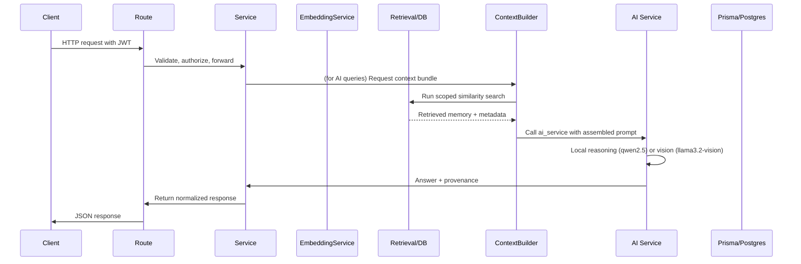

### In practice

1. The client sends a JWT-protected request
2. FastAPI route extracts the authenticated user
3. Service layer validates ownership and role constraints
4. Prisma reads or writes relational records
5. Filesystem operations run only for upload/download/delete paths
6. The response is returned in a normalized API format

### Doctor copilot request flow

- Doctor requests copilot data for a consultation or patient scope
- Route and service verify doctor ownership and patient scope
- Workflow orchestrates contextual retrieval and clinical intelligence modules
- Timeline, symptom, medication, and risk signals are composed into one response
- Output is returned as an explainable, evidence-backed clinician-facing payload

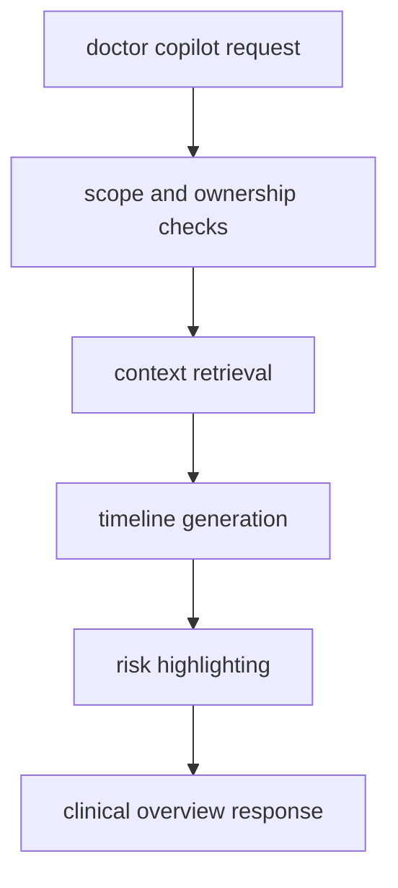

Text view: doctor copilot request -> scope and ownership checks -> context retrieval -> timeline generation -> risk highlighting -> clinical overview response.


### RAG request flow

- Client triggers an AI query.
- Service asks `context_builder_service` for retrieval-scoped results.
- Retrieval uses `embedding_service` (if needed for query) and pgvector search with metadata filters.
- `context_builder_service` composes retrieved items and invokes `ai_service` for final grounding.
- Response contains model output plus provenance metadata.

### Workflow-driven request example

We model common AI request flows as explicit workflow graphs. This keeps the route -> service call simple and delegates orchestration to LangGraph when an ordered pipeline is required.

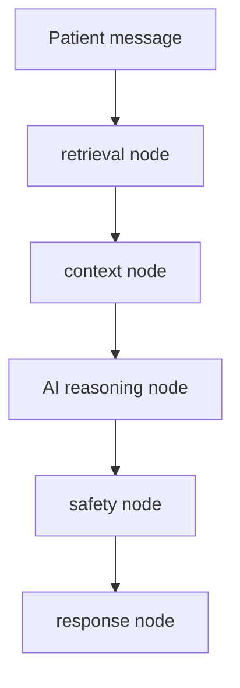

In practice the FastAPI route triggers a workflow run (or a single service call for trivial paths); the workflow engine emits structured events for observability and troubleshooting.

---

## 7) Authentication Flow

DocTalk uses JWT bearer tokens with role claims.

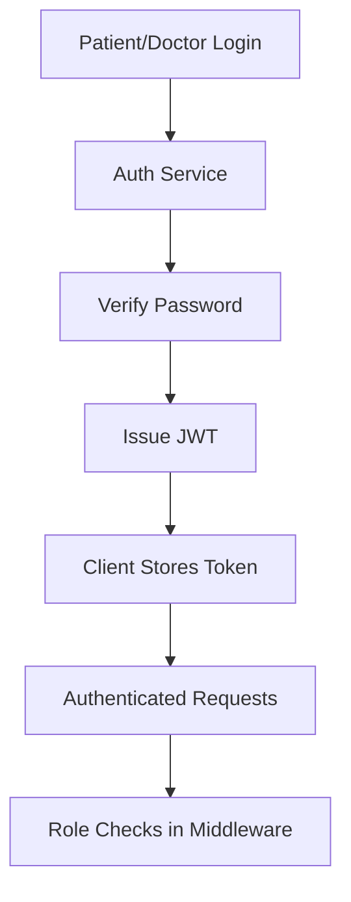

### Auth design

- Passwords are hashed with bcrypt
- JWT tokens carry user identity and role
- Middleware resolves the current user from the bearer token
- Route dependencies enforce patient-only or doctor-only access where required

| Role | Typical access |
|---|---|
| Patient | Own profile, appointments, consultations, uploaded assets |
| Doctor | Own profile, appointments, consultations, shared assets |

---

## 8) Consultation & Messaging Architecture

Consultations are relational threads created from appointments. Messaging is scoped to a consultation, which keeps the communication model simple and auditable.

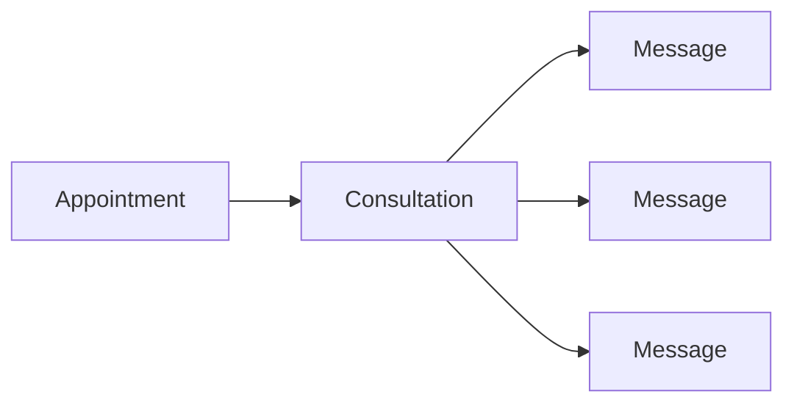

### How it works

- A consultation is created from an existing appointment
- The consultation is linked to a single patient and doctor
- Messages are stored with sender identity and role
- Access is limited to the assigned patient or doctor
- Message history supports pagination

### Why this model works

- Easy to reason about
- Suitable for solo-project scale
- Cleanly upgradeable to notifications, attachments, or additional AI summaries

---

## 9) Medical Asset Architecture

The project includes a secure file workflow for medical assets.

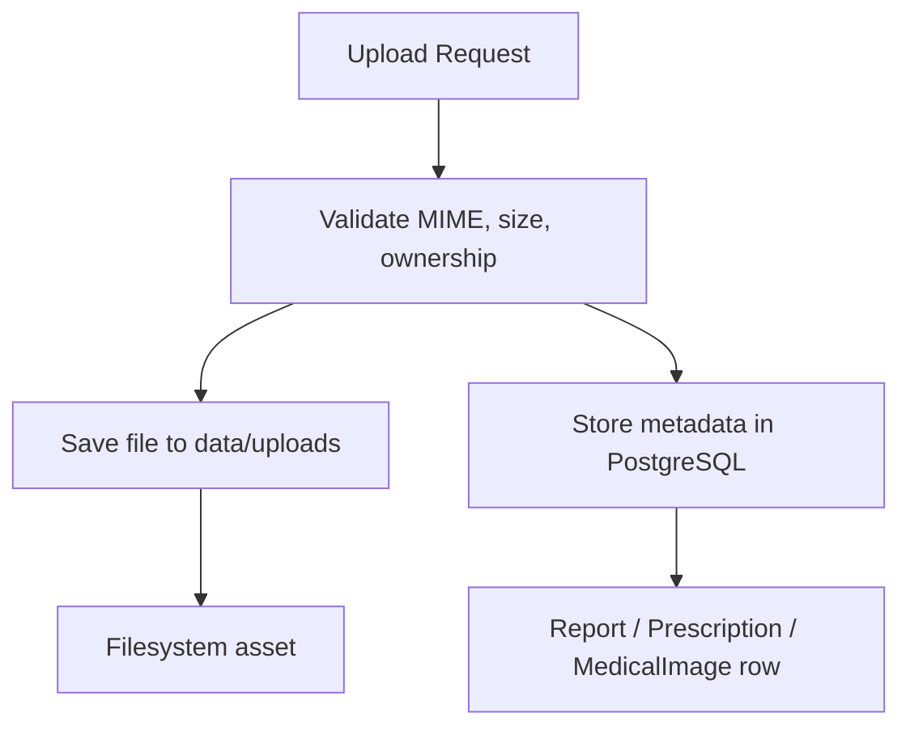

### Asset types

| Asset | Purpose | Typical upload source |
|---|---|---|
| Report | Lab results, scans, clinical PDFs | Patient or doctor |
| Prescription | Prescription documents | Doctor |
| Medical image | X-rays, images, visual diagnostics | Patient or doctor |

### Stored metadata

- patient_id
- uploaded_by
- consultation_id (optional)
- file_type
- original_name
- stored_path
- mime_type
- file_size
- timestamps

### Storage strategy

- Files are stored under `data/uploads`
- PostgreSQL stores only file metadata and relationships
- Download endpoints resolve the file path from metadata
- Delete endpoints remove both the database record and the physical file

> [!IMPORTANT]
> This is a metadata-plus-filesystem architecture, not a blob-in-database design. That keeps it simple and scalable.

## Medical Processing Architecture

The medical processing layer routes extracted content into the local AI stack and (optionally) into the RAG memory via the contextual pipeline.

```mermaid
flowchart LR
    Asset[Medical asset] --> OCR[OCR / parsing]
    OCR --> Normalize[Normalization + Summary]
    Normalize --> Embed[Embedding Service (nomic-embed-text)]
    Embed --> Store[pgvector / rag_documents]
    Normalize --> ContextBuilder[Context Builder]
    ContextBuilder --> AIService[qwen2.5:7b-instruct]
    Image[Medical image] --> Vision[llama3.2-vision]
    Vision --> Findings[Structured findings]
    Findings --> OptIn[Optional RAG ingestion]
```

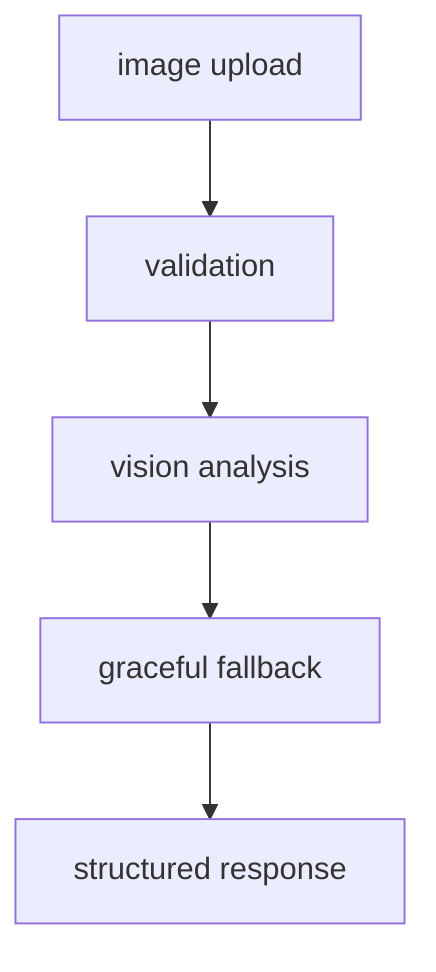

- OCR/prescription flows produce normalized summaries which are embedded and stored in `rag_documents`.
- X-ray analysis runs via the vision service and may be ingested into RAG if configured.
- All downstream AI reasoning uses the `context_builder_service` to assemble retrieval results before calling `ai_service`.
- Corrupt or invalid images are handled as structured failures so the workflow can recover without crashing.

## Vision Failure Recovery

Vision handling is designed to return structured output even when the local image cannot be analyzed.

### Recovery rules

- Invalid image files are rejected before model invocation when possible
- Corrupt files produce a structured fallback response rather than a workflow crash
- The response remains machine-readable so the caller can continue safely
- Vision routing still prefers `llama3.2-vision` for image payloads, but only when the file is readable

### Practical effect

- Prevents malformed image uploads from breaking the request path
- Keeps downstream workflow steps from receiving unusable vision output
- Maintains clear error semantics for callers and logs

---

## RAG Architecture

This design adds a lightweight semantic memory layer on top of the existing medical asset and consultation system.

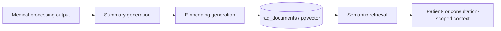

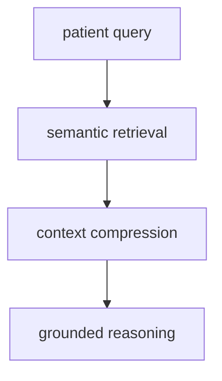

### Why this shape works

- Keeps retrieval separate from the canonical relational record
- Produces compact, normalized medical summaries instead of embedding raw chats or raw OCR text
- Makes retrieval deterministic enough for a solo-project backend while still being AI-ready
- Preserves the original source data in PostgreSQL and the filesystem

> [!NOTE]
> RAG here is a memory layer, not a replacement for consultations, assets, or structured medical records.

### Local-first behavior

- Retrieval is local through PostgreSQL and pgvector
- Embedding generation is local through Ollama
- The result is a retrieval stack that can work without any external AI service
- Retrieval context is cleaned before prompt assembly so prompt injection and noisy historical text are reduced

## Retrieval Deduplication

Retrieval now deduplicates semantically repeated rows before they are passed into prompt construction.

### What is removed

- Duplicate semantic memory rows with the same content fingerprint
- Repeated context entries that only differ by row id
- Redundant summary/content pairs that would consume context budget without adding signal

### Why it matters

- Preserves limited context space on a 6GB VRAM local runtime
- Reduces repeated evidence that can confuse generation
- Lowers the chance of hallucination caused by duplicated retrieved context
- Makes patient-scoped retrieval tighter and easier to inspect

### Cleanup behavior

- The retriever trims content and summary text before returning results
- Memory age filtering keeps stale rows out of the active context window
- Duplicate filtering happens before the prompt is assembled

---

## Semantic Medical Memory

Semantic memory stores compact medical summaries with embeddings so the backend can retrieve clinically relevant context later without replaying the full source document.

### Stored memory shape

- `rag_documents.id` — primary key
- `patient_id` — owning patient, required
- `consultation_id` — optional consultation scope
- `source_type` — report, prescription, xray, consultation summary, or manual ingest
- `content` — normalized text used for retrieval
- `summary` — short AI-ready summary
- `embedding` — pgvector vector persisted in PostgreSQL
- `metadata` — JSONB for filtering and traceability

### Why summaries are embedded

- Raw OCR and chat text is noisy, repetitive, and often too large for useful similarity search
- Summaries capture the medically relevant signal in a smaller, more stable representation
- The summary step lets the AI clean up formatting before retrieval while keeping provenance in `metadata`

### Fallback behavior

- If the embedding provider fails, the backend uses a deterministic fallback embedding
- If ingestion cannot produce a safe summary, the service can skip or normalize the record rather than storing malformed memory
- Retrieval still works with the stored vector or fallback vector, but the source metadata remains scoped to the patient

### Copilot integration

- Doctor copilot modules consume this memory as the primary context source
- Timeline, symptom, medication, and risk modules all operate on scoped retrieval output
- Evidence references in copilot responses map back to retrieved memory metadata
- Memory remains patient-isolated before any clinical intelligence synthesis

---

## Automatic Medical Ingestion Pipeline

The medical processing service now seeds the memory layer automatically after successful OCR, prescription, or X-ray analysis.

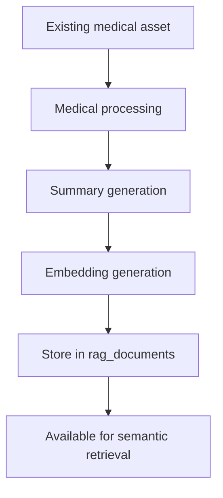

### How automatic ingestion works

1. An existing report, prescription, or X-ray is analyzed by the processing service
2. The service builds a compact summary from the structured result
3. The embedding service converts that summary into a vector
4. The RAG service stores the document in `rag_documents`
5. Duplicate-safe ingestion prevents repeated inserts for the same normalized content

### Why this is useful

- No extra manual indexing step is required after analysis
- The backend gets memory coverage immediately after OCR or model-based parsing completes
- The original asset remains the source of truth; the RAG layer only stores a retrieval-friendly derivative

---

## Workflow Orchestration

The workflow layer is a deterministic orchestration boundary that sequences service calls into named medical pipelines. LangGraph coordinates steps, but services still own validation, persistence, retrieval, and model access.

### What the workflow layer does

- Sequences retrieval, triage, contextual reasoning, summarization, and persistence
- Emits step-level logs and structured state for observability
- Allows controlled branching for escalation, fallback, or failed asset handling
- Keeps workflows narrow enough to test without a full model runtime

### What the workflow layer does not do

- It does not own business logic
- It does not perform direct database access
- It does not replace service boundaries or route authorization
- It does not make autonomous medical decisions

### Why the boundary matters

- The graph stays readable while the services stay reusable
- Step failures remain visible instead of being hidden inside large service methods
- The orchestration layer can change without rewriting core medical business logic

## Workflow-Agent Interaction

Workflows invoke agents only at controlled points where a narrow medical assistant is useful.

- The patient chat workflow can call triage before response generation
- The consultation workflow can call the summarizer before RAG ingestion
- The doctor workflow can call the doctor assistant before the final briefing
- The medical processing workflows can call the summarizer to compact OCR or analysis output

### Interaction pattern

1. A workflow collects scoped context from services
2. A controlled agent returns structured support data
3. The workflow routes that data into safety checks, formatting, or memory ingestion
4. Persistence remains a service-layer responsibility

## Workflow Observability

Workflow execution is intentionally visible and compact.

- Step start and completion logs show where the pipeline is running
- Retry boundaries are explicit and bounded per step
- Errors are attached to workflow state so failed steps can be traced quickly
- Safety-related outputs remain small enough to inspect in logs without exposing raw secrets or unnecessary payloads

## Patient Chat Workflow

An example workflow for processing an incoming patient message:

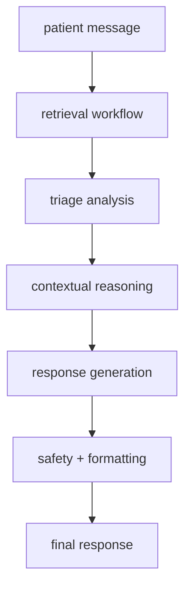

Notes:

- `retrieval workflow` calls `retrieval_service` and `context_builder_service` to assemble a scoped prompt bundle.
- `triage analysis` invokes the controlled triage agent to detect urgent symptom patterns.
- `contextual reasoning` uses `ai_service` for local reasoning and response shaping.
- `safety + formatting` normalizes output and applies policy checks before the final response.
- The final response can trigger compact RAG ingestion when the workflow produces a reusable summary.

## Report Processing Workflow

A report upload is commonly processed through an ingestion workflow:

```mermaid
flowchart TD
    Upload[report upload] --> OCR[OCR + extraction]
    OCR --> SUM[consultation summarization]
    SUM --> MEM[semantic memory]
    MEM --> STORE[RAG ingestion]
```

- The OCR step calls `ocr_service` and related extraction helpers.
- The summarization step compacts the extracted report into a retrieval-friendly medical summary.
- The memory step stores the compact output as semantic context instead of raw document text.
- The ingestion step writes to the RAG layer using patient-scoped metadata.

## X-ray Analysis Workflow

Image-based pipelines are separate to avoid model co-residency and to keep vision workloads bounded:

```mermaid
flowchart TD
    Upload[X-ray upload] --> Vision[vision analysis]
    Vision --> Findings[structured findings]
    Findings --> SUM[summary + safety]
    SUM --> OptIn[optional RAG ingestion]
```

- Vision runs on the `llama3.2-vision` model via the vision service and returns structured findings.
- Findings are normalized before persistence so the vector store only receives compact, patient-scoped content.
- Optional ingestion keeps the file-analysis result available for later retrieval without repeating the full image workflow.

## Workflow State Management

Workflows maintain minimal run state (step status, timestamps, error payloads, and important IDs) and emit structured events to a lightweight store or log. State is intentionally transient and small:

- `workflow_run.id`, `workflow_name`, `status` (running/succeeded/failed), `current_step`, `started_at`, `finished_at`, `last_error`.
- Services remain responsible for durable state (DB writes, rag_documents, file metadata).

This separation keeps orchestration recoverable and auditable without duplicating business data in the orchestration layer.

## Healthcare Safety Controls

DocTalk uses workflow-level and service-level safety controls to keep medical AI bounded and reviewable.

### Safety patterns

- Patient isolation is enforced before retrieval, summarization, or ingestion
- Ownership checks gate every workflow that touches medical records or assets
- Triage can escalate urgent symptoms without turning the workflow into an autonomous decision engine
- Safety checks sanitize output before it is shown to users or written into memory
- Workflow failures stop downstream writes instead of allowing partial unsafe persistence

### Why autonomous agents were intentionally avoided

- Unbounded agents make medical side effects harder to reason about
- Deterministic agent wrappers are easier to test and audit
- The backend needs bounded orchestration, not open-ended task execution

## Execution Telemetry

Observability focuses on step-level events, execution traces, and concise metrics:

- Emit events: `workflow.start`, `workflow.step.complete`, `workflow.step.error`, `workflow.finish`.
- Capture step latency, success rates, and model load failures.
- Persist small run metadata for troubleshooting; rely on existing logging for full traces.
- Use these signals to alert when embeddings fail, models time out, or safety checks trigger.
- Log retrieval cache hits, AI provider fallback, and database reconnect attempts as structured events.
- Keep failure logs concise and request-scoped so they are useful without leaking sensitive payloads.

## Observability & Logging

The backend uses structured logs to make runtime validation and local debugging practical.

### Logged surfaces

- Workflow start, step completion, retries, and failure paths
- Retrieval completion, cache hits, duplicate filtering, and fallback use
- AI request completion, timeout handling, malformed output handling, and provider fallback behavior
- Rate limit rejections and request validation failures
- Database connect, reconnect, and health-check failures

### Why it matters

- Makes synthetic runtime probes easy to interpret
- Helps separate model failures from persistence failures
- Keeps local troubleshooting practical without adding a full monitoring stack

How workflows support controlled assistants

- Workflows make end-to-end behaviors explicit and versionable, providing a safe surface for assistant components to call into when a bounded medical task needs to be coordinated.
- Because services contain core logic, assistant flows can compose stable service calls without re-implementing business rules.


## Embedding Generation Pipeline

The embedding layer is intentionally small and predictable.

```mermaid
flowchart LR
    Input[Normalized summary or query] --> Provider[Embedding provider]
    Provider --> Validate[Vector validation]
    Validate --> Persist[Store or query vector]
    Provider --> Fallback[Deterministic fallback embedding]
```

### Design notes

- Provider: `nomic-embed-text` (local Ollama embeddings endpoint).
- Embedding service responsibilities:
    - Validate model availability and vector dimension (expected: 384).
    - Convert normalized summaries and queries into vectors.
    - Return deterministic fallback vectors when the provider fails.
    - Expose a safe `to_vector_literal()` helper for DB insertion/search.

Design note: keep embeddings independent of reasoning so indexing and retrieval are inexpensive and stable.

---

## pgvector Integration

PostgreSQL with pgvector is used as the storage and retrieval engine for semantic memory.

### Why pgvector instead of FAISS

- Keeps relational metadata and vector search in the same database
- Avoids a second persistence system for a small backend
- Makes patient isolation, consultation filtering, and source tracking easier to enforce in SQL
- Fits the existing Prisma-centered architecture without adding a separate index service

### Persistence strategy

- Vectors are stored directly in `rag_documents.embedding`
- Metadata stays in `rag_documents.metadata` as JSONB
- The original normalized text is kept alongside the vector for explainability and fallback retrieval
- The schema stays compact and easy to migrate

> [!TIP]
> For this project, pgvector gives enough retrieval quality without introducing the operational overhead of a separate vector store.

---

## Semantic Retrieval Pipeline

```mermaid
flowchart TD
    Query[Patient or doctor query] --> QEmbed[Query embedding]
    QEmbed --> Search[Vector similarity search]
    Search --> Filter[Patient / consultation metadata filtering]
    Filter --> Results[Relevant medical memory]
    Results --> Context[AI-ready context]
```

### Retrieval safeguards

- Search is always scoped to the authenticated patient or permitted doctor scope
- Consultation-scoped retrieval only returns rows linked to that consultation when requested
- Metadata filters run alongside vector similarity, not after the fact
- Duplicate documents are skipped during ingestion so repeated analysis does not inflate retrieval noise

### Context assembly

- The retriever returns concise, relevant memory items
- The calling service can feed those items into a later AI prompt or medical workflow
- This keeps generation separate from retrieval and makes the system easier to reason about

---

## Patient Isolation & Metadata Filtering

Healthcare retrieval must never cross patient boundaries, even when two summaries look semantically similar.

### Isolation rules

- Every RAG document belongs to exactly one patient
- Optional consultation scope further narrows access when a workflow is consultation-specific
- Metadata filtering ensures the database only returns documents from the authorized scope
- Service-layer checks prevent a query from escaping its allowed patient or consultation context

### Why metadata filtering is critical

- Semantic similarity alone is not sufficient in healthcare
- Two patients can share similar symptoms, medications, or report language
- Without metadata filtering, a vector search could leak another patient’s memory
- Combining vector search with relational scoping keeps retrieval clinically safe and predictable

---

## Context-Aware Medical Retrieval

The retrieval layer is consultation-aware, which means it can return memory that is relevant to the current visit instead of only the broad patient history.

### Supported scopes

- Patient-wide memory for longitudinal context
- Consultation-specific memory for active visit support
- Source-aware retrieval for reports, prescriptions, X-rays, or consultation summaries

### Practical outcome

- A doctor can search the patient’s memory and see relevant prior medical context
- A patient-scoped lookup can surface medication or report history without exposing another user’s records
- The result set is small enough to be useful in downstream prompts

---

## 10) Database Design Overview

Prisma is the source of truth for backend schema design.

### Core relational entities

| Model | Purpose |
|---|---|
| Patient | Patient identity and clinical profile |
| Doctor | Doctor identity and profile |
| Appointment | Scheduling and medical visit state |
| Consultation | Appointment-linked communication thread |
| Message | Consultation chat message |
| Report | Medical report metadata |
| Prescription | Prescription metadata |
| MedicalImage | X-ray/image metadata |
| RagDocument | Semantic medical memory with pgvector embedding |

### Design notes

- Appointments connect patients and doctors
- Consultations are unique per appointment
- Messages belong to consultations
- Medical asset tables store ownership and optional consultation linkage
- RagDocument stores patient-scoped semantic memory with optional consultation linkage
- Consultation-aware retrieval uses the same relational keys as the rest of the backend
- Data is normalized enough for clarity, but not over-modeled for a solo project

---

## 11) Security Design

Security is built into the backend rather than added as an afterthought.

### Security controls

- JWT authentication for protected requests
- Role-based route gating
- Ownership validation on consultations and file assets
- MIME type and extension validation for uploads
- File size limits for uploaded assets
- Unauthorized access returns `403 Forbidden`
- Patient isolation is enforced at the service layer for RAG queries
- Retrieval uses metadata filtering so semantic search cannot cross patient boundaries
- Consultation-scoped memory is only returned when the consultation relationship is valid
- JWT validation rejects empty, oversized, malformed, and payload-inconsistent tokens
- Request schemas forbid extra fields to reduce payload ambiguity
- Upload validation checks extension, MIME type, size, and file integrity before persistence
- File resolution stays rooted under the managed storage directory to prevent traversal mistakes
- Retrieved context is sanitized before it reaches prompt construction or memory ingestion
- Unsafe prompt fragments are stripped before local AI reasoning is invoked

### Access rule summary

| Resource | Who can access |
|---|---|
| Patient profile | The patient, or doctor where explicitly allowed |
| Doctor profile | The doctor |
| Consultation | Assigned patient and doctor only |
| Medical files | Assigned patient or linked doctor |

### File safety model

- Reject missing files
- Reject unsupported file types
- Reject oversized uploads
- Reject uploads for another patient
- Reject downloads from unauthorized users

### RAG safety model

- Reject searches outside the authenticated patient scope
- Reject consultation-scoped searches when the consultation does not belong to the requester
- Skip or normalize malformed embeddings rather than persisting unsafe vectors
- Keep the canonical clinical record separate from semantic memory
- Sanitize retrieved text before it is embedded into prompts or summaries
- Drop stale and duplicate memory entries before they reach the model

## Security Hardening

Security hardening is applied at the request, file, retrieval, and prompt boundaries.

### Hardening measures

- JWT payload validation and oversized-token rejection
- Strict request schemas that forbid extra fields
- File path resolution that stays rooted under the managed storage directory
- In-memory rate limiting for public routes
- Retrieval sanitization, duplicate filtering, and retention-aware memory lookup
- AI response sanitization and workflow fail-fast behavior when assets or model steps fail

### Security posture

- Fail closed when identity, scope, or payload validation is uncertain
- Prefer explicit 401, 403, 404, 413, and 415 responses over generic exceptions
- Keep unsafe model output out of persisted memory and downstream prompts

---

## 12) API Structure

The API is grouped by domain and intentionally kept shallow.

```text
/api/auth
/api/patient
/api/doctor
/api/appointments
/api/chat
/api/reports
/api/prescriptions
/api/medical_images
 /api/processing
```

### Example endpoint categories

| Domain | Examples |
|---|---|
| Auth | signup, login, profile lookup |
| Appointments | create, approve, cancel, history |
| Chat | create consultation, list consultations, send messages, fetch history |
| Reports | upload, list, metadata, download, delete |
| Prescriptions | upload, list, metadata, download, delete |
| Medical images | upload, list, metadata, download, delete |

---

## 13) Technologies Used

| Technology | Purpose |
|---|---|
| FastAPI | HTTP API framework |
| Prisma | ORM and relational schema management |
| PostgreSQL | Primary persistent data store |
| Docker | Local database environment |
| JWT | Authentication and authorization |
| bcrypt | Password hashing |
| python-multipart | Multipart file uploads |
| Pillow / PyMuPDF | Supporting document and image workflows |
| Ollama | Local runtime for text, vision, and embeddings models |
| pgvector | Vector storage and semantic search in PostgreSQL |

Embedding vector dimension: 384 (nomic-embed-text default)

---

## Runtime Constraints

The backend is optimized for a local-first solo deployment, not a horizontally scaled AI cluster.

### Practical constraints

- One heavy local model should be active at a time when possible
- Ollama timeouts should stay bounded so request latency does not stall the app
- VRAM pressure is more important than raw throughput on an RTX 4050 6GB class device
- Context size should stay compact to avoid unnecessary model switching and memory spikes
- Retrieval and AI fallbacks are preferred over unbounded retries

### Resulting behavior

- Reasoning and vision are routed selectively to reduce local resource contention
- Embeddings and retrieval are cached to reduce repeated computation
- The backend is intentionally more predictable than aggressive under constrained hardware

---

## 14) Deployment Notes

DocTalk is deployed as a local-first healthcare AI backend rather than a cloud-LLM service.

### Runtime requirements

- PostgreSQL with pgvector enabled
- Ollama running locally with the required models pulled
- Recommended hardware for local inference: GPU (e.g., RTX 4050 6GB) and 16 GB RAM, noting that only one heavy model should be resident at a time for predictable behavior
- Stable local network access to the Ollama endpoint; the backend uses bounded timeouts and safe fallbacks when the model server is slow or unavailable
- A writable application data directory for file uploads, OCR output, and RAG persistence

### Required models

- `qwen2.5:7b-instruct`
- `llama3.2-vision`
- `nomic-embed-text`

### Practical guidance

- Pull models with Ollama before starting the app (`ollama pull <model>`).
- Start PostgreSQL (Docker Compose) before the application so migrations and pgvector are available.
- Prefer short-lived vision runs; run embedding tasks on CPU when possible to avoid GPU pressure.
- Keep only one heavy model active at a time when possible so response times and memory usage remain predictable.
- The backend applies lightweight request rate limiting on public traffic and rejects malformed request payloads early.
- Database connectivity uses reconnect-on-health-failure logic, so transient Prisma disconnects should recover without a restart.
- Expect graceful degradation: unsafe prompts are sanitized, invalid AI outputs are guarded, and failed workflows stop instead of continuing in a broken state.
- If retrieval or workflow behavior looks stale, check the configured RAG memory retention window and the local Ollama logs first.

## Runtime Validation

Validation is done with small synthetic probes that exercise the real service boundaries.

### Probe coverage

- Malformed payload rejection and strict request validation
- Invalid and expired JWT handling
- Unauthorized access attempts across patient and doctor scopes
- File upload validation, including invalid MIME types and corrupt files
- Contextual retrieval with patient isolation and duplicate filtering
- Local model routing, fallback handling, and corrupt image recovery
- Workflow fail-fast behavior and partial recovery behavior

### Validation model

- Prefer small synthetic probes over large end-to-end fixtures when validating runtime hardening
- Use fake adapters for Prisma and Ollama where needed
- Confirm that failures stay structured and scoped to the affected request

## Deployment Considerations

The backend is ready for a practical local-first deployment, but it should still be operated with realistic constraints in mind.

### Recommended posture

- Keep PostgreSQL, the backend, and Ollama on the same trusted local network or host when possible
- Avoid overcommitting GPU memory with multiple heavy local models
- Treat rate limiting, strict payload validation, and file validation as required runtime protections, not optional extras
- Keep logs and data directories available for troubleshooting and recovery

### What this deployment is good at

- Solo-project and portfolio deployment
- Local AI workflows with bounded scope
- Patient-scoped retrieval and consultation support
- Demonstrating a realistic healthcare backend with pragmatic AI integration

## Troubleshooting

### Common symptoms

- Ollama timeout or fallback warnings usually indicate local model pressure or a missing model pull
- Retrieval returning too much repeated context usually means stale or duplicate memory needs review
- Image analysis failures usually come from invalid uploads or unreadable files
- Database reconnect warnings usually indicate a transient Prisma or Postgres connectivity issue

### First checks

- Confirm the expected Ollama models are pulled
- Check that PostgreSQL and pgvector are available
- Review workflow logs for the exact step that failed
- Verify the upload file type and size before retrying
- Confirm the patient scope of the query before assuming a retrieval bug

---

## 15) Operational Enhancements

The backend remains intentionally modular so it can absorb additional medical workflows without rewriting the core system.

### Useful expansion areas

- Async background processing for large asset parsing and RAG ingestion
- Better retrieval ranking and summary quality tuning
- Comprehensive monitoring, logging, and alerting for AI endpoints
- Production hardening: secrets management, backups, and rate-limiting
- Additional controlled workflow branches for new medical document types
- Optional object storage for large files and scalable search indexing

---

## 16) Workflow-Agent Boundaries

The workflow layer now coordinates the medical assistant layer directly. LangGraph remains orchestration-only, and the agent layer stays deterministic and scoped to the current request.

### Current pattern

```mermaid
flowchart LR
    Query[scoped request] --> Retrieve[retrieval workflow]
    Retrieve --> Triage[triage agent]
    Triage --> Summarize[summary agent]
    Summarize --> Reason[controlled reasoning]
    Reason --> Response[structured response]
```

### Boundary rules

- Retrieval always runs inside the authenticated patient or consultation scope
- Agents only transform already-scoped data into compact clinical support output
- Workflows own branching, retries, and step ordering
- Services own persistence, validation, and model routing

> [!NOTE]
> The assistant layer is useful because it is controlled, not autonomous.

## 17) Development Philosophy

DocTalk follows a simple and professional development philosophy:

- Keep the backend understandable at a glance
- Prefer explicit relational data over hidden state
- Write services that can be tested independently
- Avoid unnecessary abstraction until it proves useful
- Build AI capability on top of a stable clinical foundation

This keeps the project realistic, reviewable, and easy to extend.

---

## 18) Scalability Considerations

The current backend is designed for solo-project scale, but it remains scalable in the right ways.

### What already scales well

- Relational schema with Prisma
- File storage separated from metadata
- Clear service boundaries
- Easy route extension by domain
- Consultation-linked communication model

### What can be improved later

- Background jobs for file parsing
- Object storage instead of local disk
- Search indexing for documents
- Async AI workflows
- Audit trails and event logs

---

## 19) Production Hardening Notes

The backend already includes a minimal hardening layer for day-to-day operation:

- JWT payload validation and oversized-token rejection
- Strict request schemas that forbid extra fields
- File path resolution that stays rooted under the managed storage directory
- In-memory rate limiting for public routes
- Database reconnect retries and safe health-check fallback behavior
- Retrieval sanitization, duplicate filtering, and retention-aware memory lookup
- AI response sanitization and workflow fail-fast behavior when assets or model steps fail

Before broader production use, the backend would still benefit from:

- Object storage for medical files
- Virus scanning for uploads
- Comprehensive audit logging
- Background job queue for OCR and parsing
- Structured observability and tracing
- Backups and disaster recovery strategy
- Environment-specific secrets management

> [!TIP]
> The current system is deployable as a local-first backend, but the remaining items matter if the deployment needs stronger isolation, compliance, or operational scale.

---

## Startup Instructions

### Local development

```powershell
cd D:\DocTalk
.\.venv\Scripts\Activate.ps1
python -m uvicorn backend.main:app --reload --host 127.0.0.1 --port 8000
```

### Prisma commands

```powershell
npx prisma generate
npx prisma db push
```

### Docker database commands

```powershell
docker compose up -d
docker compose logs -f
```

### Development workflow

1. Update schema or backend services
2. Run `npx prisma generate`
3. Run `npx prisma db push`
4. Start FastAPI locally
5. Validate the affected route with a small smoke test
6. Confirm role-based access and data persistence

---

## Summary

DocTalk’s backend is now a clean relational healthcare foundation with:

- secure authentication
- appointment and consultation workflows
- secure messaging
- robust medical asset management
- Prisma-backed metadata storage
- filesystem-based binary storage
- a practical path to AI integration

It is intentionally simple, professional, and well-positioned for OCR, RAG, and controlled workflow-driven assistants.