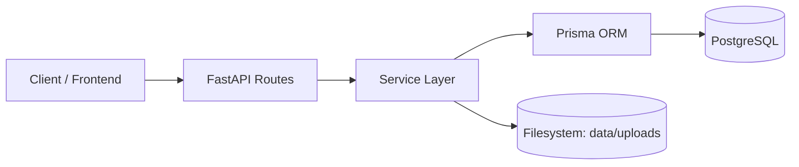
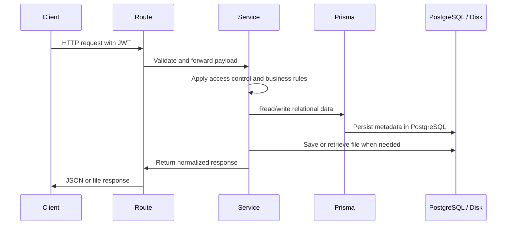
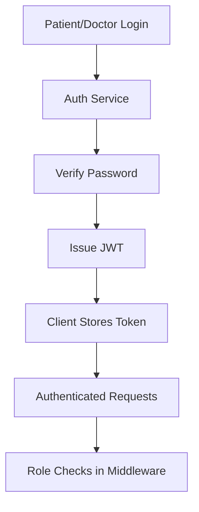
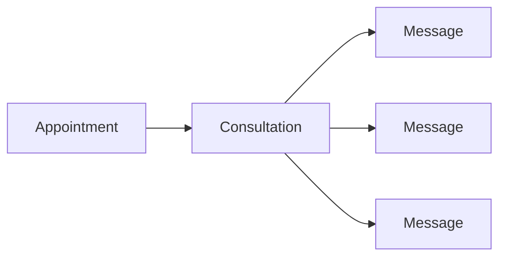
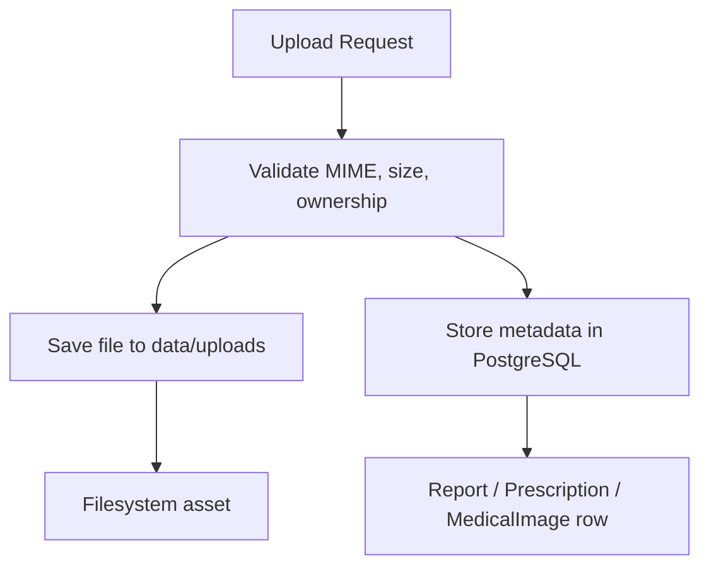
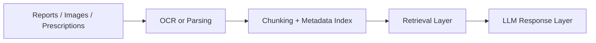
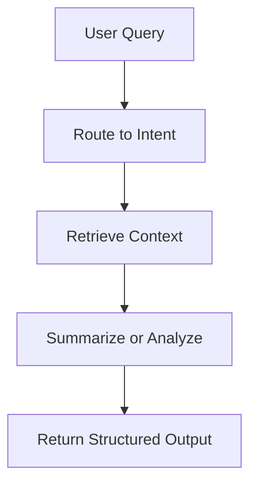

# DocTalk Backend Architecture

> **DocTalk** is a modular healthcare backend built with **FastAPI**, **Prisma**, **PostgreSQL**, **Docker**, and **JWT-based security**. The current implementation is a strong solo-project backend foundation with relational consultations, messaging, and secure medical asset handling, ready for future AI workflows such as OCR, RAG, and agent orchestration.

---

## 1) Project Overview

DocTalk is a healthcare backend designed to support patient-doctor interactions, appointment scheduling, consultation messaging, and secure file handling for medical documents and images. The system is intentionally structured to stay clean, practical, and production-minded without adding unnecessary enterprise overhead.

### What it does today

- Supports patient and doctor accounts with JWT authentication
- Manages appointments and consultation threads
- Stores medical assets such as reports, prescriptions, and medical images
- Separates file metadata in PostgreSQL from binary storage on disk
- Enforces ownership and role-based access control across protected resources

### High-level intent

The backend is designed as a stable clinical data layer that can later feed OCR, retrieval pipelines, AI assistants, and physician-facing workflows.

---

## 2) Backend Goals

The backend is optimized around five goals:

| Goal | Description |
|---|---|
| Security | Protect patient data with authenticated, role-aware access control |
| Clarity | Keep routing thin and move logic into services |
| Reliability | Store relational data in PostgreSQL with Prisma-managed schema |
| Extensibility | Make room for OCR, RAG, and AI workflows later |
| Practicality | Keep the project realistic for a solo final-year build |

> [!NOTE]
> The current codebase focuses on a clean clinical backend foundation first. AI features are intentionally planned, not prematurely embedded into core workflows.

---

## 3) Current Backend Features

### Implemented capabilities

- FastAPI application foundation with health endpoints
- PostgreSQL database managed through Docker Compose
- Prisma ORM for schema modeling and database access
- JWT authentication for patients and doctors
- Role-based access control for protected routes
- Patient and doctor profile APIs
- Appointment creation and management
- Consultation creation linked to appointments
- Secure chat-style messaging inside consultations
- Secure upload system for medical assets
- Metadata storage in PostgreSQL and file storage under `data/uploads`

### Medical asset types

- Reports
- Prescriptions
- Medical images / X-rays

---

## 4) Backend Architecture

The backend follows a simple, readable service-oriented layout.



### Architectural principles

- **Routes stay thin** and only handle request/response plumbing
- **Services contain business logic** and access checks
- **Prisma handles relational data** and schema consistency
- **Files live on disk**, while metadata stays in the database
- **Authorization is checked before any sensitive operation**

> [!TIP]
> This separation keeps future OCR and AI ingestion work isolated from core clinical CRUD logic.

---

## 5) Folder Structure

### Backend layout

```text
backend/
├── api/
│   ├── auth/
│   ├── appointments/
│   ├── chat/
│   ├── doctor/
│   ├── patient/
│   ├── reports/
│   ├── prescriptions/
│   └── medical_images/
├── core/
├── middleware/
├── services/
├── utils/
├── main.py
└── backend.md
```

### Supporting project structure

```text
prisma/
└── schema.prisma

data/
└── uploads/

docker-compose.yml
requirements.txt
.env
```

---

## 6) Request Flow



### In practice

1. The client sends a JWT-protected request
2. FastAPI route extracts the authenticated user
3. Service layer validates ownership and role constraints
4. Prisma reads or writes relational records
5. Filesystem operations run only for upload/download/delete paths
6. The response is returned in a normalized API format

---

## 7) Authentication Flow

DocTalk uses JWT bearer tokens with role claims.



### Auth design

- Passwords are hashed with bcrypt
- JWT tokens carry user identity and role
- Middleware resolves the current user from the bearer token
- Route dependencies enforce patient-only or doctor-only access where required

| Role | Typical access |
|---|---|
| Patient | Own profile, appointments, consultations, uploaded assets |
| Doctor | Own profile, appointments, consultations, shared assets |

---

## 8) Consultation & Messaging Architecture

Consultations are relational threads created from appointments. Messaging is scoped to a consultation, which keeps the communication model simple and auditable.



### How it works

- A consultation is created from an existing appointment
- The consultation is linked to a single patient and doctor
- Messages are stored with sender identity and role
- Access is limited to the assigned patient or doctor
- Message history supports pagination

### Why this model works

- Easy to reason about
- Suitable for solo-project scale
- Cleanly upgradeable to notifications, attachments, or future AI summaries

---

## 9) Medical Asset Architecture

Stage 5 introduced a secure file workflow for medical assets.



### Asset types

| Asset | Purpose | Typical upload source |
|---|---|---|
| Report | Lab results, scans, clinical PDFs | Patient or doctor |
| Prescription | Prescription documents | Doctor |
| Medical image | X-rays, images, visual diagnostics | Patient or doctor |

### Stored metadata

- patient_id
- uploaded_by
- consultation_id (optional)
- file_type
- original_name
- stored_path
- mime_type
- file_size
- timestamps

### Storage strategy

- Files are stored under `data/uploads`
- PostgreSQL stores only file metadata and relationships
- Download endpoints resolve the file path from metadata
- Delete endpoints remove both the database record and the physical file

> [!IMPORTANT]
> This is a metadata-plus-filesystem architecture, not a blob-in-database design. That keeps it simple and scalable.

---

## 10) Database Design Overview

Prisma is the source of truth for backend schema design.

### Core relational entities

| Model | Purpose |
|---|---|
| Patient | Patient identity and clinical profile |
| Doctor | Doctor identity and profile |
| Appointment | Scheduling and medical visit state |
| Consultation | Appointment-linked communication thread |
| Message | Consultation chat message |
| Report | Medical report metadata |
| Prescription | Prescription metadata |
| MedicalImage | X-ray/image metadata |

### Design notes

- Appointments connect patients and doctors
- Consultations are unique per appointment
- Messages belong to consultations
- Medical asset tables store ownership and optional consultation linkage
- Data is normalized enough for clarity, but not over-modeled for a solo project

---

## 11) Security Design

Security is built into the backend rather than added as an afterthought.

### Security controls

- JWT authentication for protected requests
- Role-based route gating
- Ownership validation on consultations and file assets
- MIME type and extension validation for uploads
- File size limits for uploaded assets
- Unauthorized access returns `403 Forbidden`

### Access rule summary

| Resource | Who can access |
|---|---|
| Patient profile | The patient, or doctor where explicitly allowed |
| Doctor profile | The doctor |
| Consultation | Assigned patient and doctor only |
| Medical files | Assigned patient or linked doctor |

### File safety model

- Reject missing files
- Reject unsupported file types
- Reject oversized uploads
- Reject uploads for another patient
- Reject downloads from unauthorized users

---

## 12) API Structure

The API is grouped by domain and intentionally kept shallow.

```text
/api/auth
/api/patient
/api/doctor
/api/appointments
/api/chat
/api/reports
/api/prescriptions
/api/medical_images
```

### Example endpoint categories

| Domain | Examples |
|---|---|
| Auth | signup, login, profile lookup |
| Appointments | create, approve, cancel, history |
| Chat | create consultation, list consultations, send messages, fetch history |
| Reports | upload, list, metadata, download, delete |
| Prescriptions | upload, list, metadata, download, delete |
| Medical images | upload, list, metadata, download, delete |

---

## 13) Technologies Used

| Technology | Purpose |
|---|---|
| FastAPI | HTTP API framework |
| Prisma | ORM and relational schema management |
| PostgreSQL | Primary persistent data store |
| Docker | Local database environment |
| JWT | Authentication and authorization |
| bcrypt | Password hashing |
| python-multipart | Multipart file uploads |
| Pillow / PyMuPDF | Supporting future document and image workflows |

---

## 14) Future Roadmap

The backend is intentionally structured to support future expansion without rewriting the core system.

### Near-term roadmap

- Rich file previews
- Async processing for larger assets
- Better audit logging
- Deeper document search
- Notification hooks for doctors and patients

### Longer-term roadmap

- OCR for reports and scans
- Retrieval-based medical knowledge workflows
- AI-assisted summarization of consultations
- Physician-facing review tools

---

## 15) Planned RAG Integration

RAG will be introduced as a later layer on top of the current asset and consultation system.

### Intended flow



### Planned scope

- Extract text from reports and prescriptions
- Attach metadata such as patient, doctor, consultation, and timestamps
- Retrieve relevant clinical context on demand
- Keep patient-specific retrieval isolated and permission aware

> [!NOTE]
> RAG should augment clinical context, not replace the authoritative relational data in PostgreSQL.

---

## 16) Planned LangGraph Workflow Architecture

LangGraph is planned as an orchestration layer, not as the system’s core data model.

### Planned workflow pattern



### Intended use cases

- Consultation summarization
- Document-to-summary pipelines
- Follow-up guidance workflows
- Controlled handoff between retrieval and generation steps

---

## 17) Planned AI Agent System

Agents are intentionally deferred until the backend data layer is stable.

### Planned agent responsibilities

- Assist with document triage
- Summarize consultation history
- Surface relevant prior records
- Organize workflow steps for complex clinical interactions

### Guardrails

- Agents should not directly mutate clinical records without explicit service-layer control
- Agent outputs should remain traceable to source data
- Authorization must still be enforced by the backend

---

## 18) Development Philosophy

DocTalk follows a simple and professional development philosophy:

- Keep the backend understandable at a glance
- Prefer explicit relational data over hidden state
- Write services that can be tested independently
- Avoid unnecessary abstraction until it proves useful
- Build future AI capability on top of a stable clinical foundation

This keeps the project realistic, reviewable, and easy to extend.

---

## 19) Scalability Considerations

The current backend is designed for solo-project scale, but it remains scalable in the right ways.

### What already scales well

- Relational schema with Prisma
- File storage separated from metadata
- Clear service boundaries
- Easy route extension by domain
- Consultation-linked communication model

### What can be improved later

- Background jobs for file parsing
- Object storage instead of local disk
- Search indexing for documents
- Async AI workflows
- Audit trails and event logs

---

## 20) Future Production Improvements

Before production use, the backend would benefit from:

- Object storage for medical files
- Virus scanning for uploads
- Comprehensive audit logging
- Rate limiting on public endpoints
- Background job queue for OCR and parsing
- Structured observability and tracing
- Backups and disaster recovery strategy
- Environment-specific secrets management

> [!TIP]
> None of these are required to make the current backend understandable or reviewable. They are natural production hardening steps for a later phase.

---

## Startup Instructions

### Local development

```powershell
cd D:\DocTalk
.\.venv\Scripts\Activate.ps1
python -m uvicorn backend.main:app --reload --host 127.0.0.1 --port 8000
```

### Prisma commands

```powershell
npx prisma generate
npx prisma db push
```

### Docker database commands

```powershell
docker compose up -d
docker compose logs -f
```

### Development workflow

1. Update schema or backend services
2. Run `npx prisma generate`
3. Run `npx prisma db push`
4. Start FastAPI locally
5. Validate the affected route with a small smoke test
6. Confirm role-based access and data persistence

---

## Summary

DocTalk’s backend is now a clean relational healthcare foundation with:

- secure authentication
- appointment and consultation workflows
- secure messaging
- robust medical asset management
- Prisma-backed metadata storage
- filesystem-based binary storage
- a practical path to future AI integration

It is intentionally simple, professional, and well-positioned for OCR, RAG, and agentic features in later phases.