# DocTalk Backend Architecture

> **DocTalk** is a modular healthcare backend built with **FastAPI**, **Prisma**, **PostgreSQL**, **Docker**, and **JWT-based security**. The current implementation is a strong solo-project backend foundation with relational consultations, messaging, secure medical asset handling, and a fully local Ollama-based AI stack for OCR, RAG, and clinical reasoning.

---

## 1) Project Overview

DocTalk is a healthcare backend designed to support patient-doctor interactions, appointment scheduling, consultation messaging, and secure file handling for medical documents and images. The system is intentionally structured to stay clean, practical, and production-minded without adding unnecessary enterprise overhead.

### What it does today

- Supports patient and doctor accounts with JWT authentication
- Manages appointments and consultation threads
- Stores medical assets such as reports, prescriptions, and medical images
- Separates file metadata in PostgreSQL from binary storage on disk
- Enforces ownership and role-based access control across protected resources

### High-level intent

The backend is designed as a stable clinical data layer that now feeds OCR, retrieval pipelines, local AI assistants, and physician-facing workflows without relying on cloud model providers.

### Stage 10: Workflow orchestration

Stage 10 adds a lightweight workflow orchestration layer (LangGraph) to coordinate existing services into explicit, observable pipelines. Workflows orchestrate retrieval, context assembly, model reasoning, safety checks, and storage without moving core business logic out of services.

---

## 2) Backend Goals

The backend is optimized around five goals:

| Goal | Description |
|---|---|
| Security | Protect patient data with authenticated, role-aware access control |
| Clarity | Keep routing thin and move logic into services |
| Reliability | Store relational data in PostgreSQL with Prisma-managed schema |
| Extensibility | Make room for OCR, RAG, and AI workflows later |
| Practicality | Keep the project realistic for a solo final-year build |

> [!NOTE]
> The current codebase focuses on a clean clinical backend foundation first. AI features are intentionally planned, not prematurely embedded into core workflows.

---

## 3) Current Backend Features

### Implemented capabilities

- FastAPI application foundation with health endpoints
- PostgreSQL database managed through Docker Compose
- Prisma ORM for schema modeling and database access
- JWT authentication for patients and doctors
- Role-based access control for protected routes
- Patient and doctor profile APIs
- Appointment creation and management
- Consultation creation linked to appointments
- Secure chat-style messaging inside consultations
- Secure upload system for medical assets
- Metadata storage in PostgreSQL and file storage under `data/uploads`
- Medical processing pipelines (OCR, prescription parsing, X-ray analysis) with standardized structured outputs
- Centralized AI/model access service backed by local Ollama runtime routing
- pgvector-backed RAG foundation for semantic medical memory and retrieval
- Automatic ingestion of structured medical processing output into patient-scoped memory
- Consultation-aware and metadata-filtered retrieval for AI-ready context assembly
- Offline-capable local AI architecture optimized for a 6GB VRAM GPU and 16GB RAM

### Medical asset types

- Reports
- Prescriptions
- Medical images / X-rays

---


## RAG Architecture

RAG is a single, coherent pipeline integrated with the AI service and scoped to patient/consultation boundaries.


### Architectural principles

- **Routes stay thin** and only handle request/response plumbing
- **Services contain business logic** and access checks
- **Prisma handles relational data** and schema consistency
- **Files live on disk**, while metadata stays in the database
- **Authorization is checked before any sensitive operation**
- **RAG is a service-layer pipeline** with explicit summary, embedding, storage, and retrieval steps
- **Summaries are embedded instead of raw chats** so the memory layer stays compact, normalized, and clinically relevant

> [!TIP]
> This separation keeps future OCR and AI ingestion work isolated from core clinical CRUD logic.

## Local AI Architecture

DocTalk uses a fully local AI stack so the backend can run without cloud dependencies. The provider-layer is isolated in the AI service and related embedding/retrieval services so the rest of the application remains unchanged.

### Current local models

| Purpose | Model |
|---|---|
| Reasoning, chat, summaries, RAG-grounded responses, prescription & OCR reasoning | qwen2.5:7b-instruct |
| Embeddings and semantic retrieval | nomic-embed-text |
| Vision and X-ray analysis | llama3.2-vision |

### Design principle

- Embeddings are generated by a dedicated embedding service and stored in pgvector; reasoning never reuses the embedding model path.
- Vision workloads are isolated to a vision route/service to avoid co-residency with the text model.
- The AI layer is service-oriented: `embedding_service`, `retrieval_service`, `context_builder_service`, and `ai_service` provide clear responsibilities and safe provider swaps.

Workflow orchestration (Stage 10)

- A thin orchestration layer (LangGraph) sequences service calls into named workflows (e.g., `patient_chat`, `report_processing`, `xray_analysis`).
- LangGraph is used for coordination only: services retain the authoritative business logic, validation, and DB access.
- Orchestration improves maintainability by making end-to-end behavior explicit, testable, and observable while keeping implementation details inside services.


## Ollama Integration

Ollama is the local runtime provider for all model calls. The backend communicates with Ollama over its HTTP API (default: `http://localhost:11434`). Key integration points:

- A single async HTTP client is reused for inference calls.
- Chat/reasoning requests use the Ollama chat endpoint; vision uses a dedicated image/vision endpoint.
- Embeddings call Ollama's embeddings endpoint (configured to `nomic-embed-text`).
- Calls include short `keep_alive` hints to reduce VRAM residency and avoid long-lived heavy-model residency.
- Robust error handling: timeouts, malformed responses, model-missing errors, and deterministic fallbacks are implemented in the embedding and ai services.

## Local Model Routing

Routing rules are enforced in the AI service so callers only select a task and scope. Routing summary:

| Task | Model |
|---|---|
| Consultation reasoning | qwen2.5:7b-instruct |
| Summaries and retrieval-grounded responses | qwen2.5:7b-instruct |
| OCR reasoning | qwen2.5:7b-instruct |
| Prescription analysis | qwen2.5:7b-instruct |
| X-ray and image analysis | llama3.2-vision |
| Semantic embeddings | nomic-embed-text |

Routing guarantees:

- Embeddings are never produced by the reasoning model.
- Vision calls are routed to the vision model via a separate service to avoid interfering with text inference.
- The system prefers short-lived model loads and single heavy-model residency where possible to fit limited VRAM hardware.

## VRAM Optimization Strategy

This project targets modest GPU setups (e.g., RTX 4050 6GB). Practical constraints and mitigations:

- Avoid co-residency of `qwen2.5` and `llama3.2-vision` on GPU; prefer sequential, short-lived vision runs.
- Use short `keep_alive` times for vision and conservative keep-alive for text.
- Keep prompt/context window small by default and limit output tokens to reduce memory pressure.
- Run embeddings on CPU or small residency models where available; `nomic-embed-text` is lightweight and kept separate.
- Provide deterministic fallbacks when models cannot load in time to avoid request failures.

## Offline-First Healthcare AI

This backend is now usable as an offline-capable healthcare AI system.

### Why this matters

- Clinical review should not depend on an external API being online
- Local inference is more predictable for a solo deployment
- Offline retrieval and summaries still work when the provider is unavailable
- The system degrades safely instead of breaking the request path

### What still depends on infrastructure

- PostgreSQL and pgvector must still be available
- Ollama must be running locally for live inference
- File uploads still require the local filesystem


## 5) Folder Structure

### Backend layout

```text
backend/
├── api/
│   ├── auth/
│   ├── appointments/
│   ├── chat/
│   ├── doctor/
│   ├── patient/
│   ├── reports/
│   ├── prescriptions/
│   ├── medical_images/
│   └── processing/          # Stage 6: OCR, prescription, x-ray analysis routes
├── core/
├── middleware/
├── services/
│   ├── ai_service.py               # model calls, routing, timeouts
│   ├── embedding_service.py        # nomic-embed-text integration
│   ├── retrieval_service.py        # DB + pgvector search
│   ├── rag_service.py              # rag_documents persistence logic
│   ├── context_builder_service.py  # assemble AI-ready context bundles
│   ├── medical_processing_service.py
│   ├── ocr_service.py
│   ├── prescription_analysis_service.py
│   └── xray_analysis_service.py
├── utils/
├── main.py
└── backend.md
```

### Supporting project structure

```text
prisma/
└── schema.prisma

data/
└── uploads/

docker-compose.yml
requirements.txt
.env
```

---

## 6) Request Flow

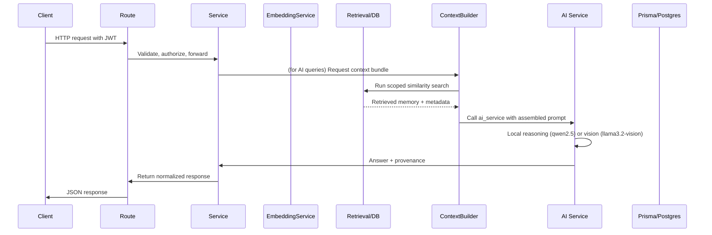

### In practice

1. The client sends a JWT-protected request
2. FastAPI route extracts the authenticated user
3. Service layer validates ownership and role constraints
4. Prisma reads or writes relational records
5. Filesystem operations run only for upload/download/delete paths
6. The response is returned in a normalized API format


### RAG request flow

- Client triggers an AI query.
- Service asks `context_builder_service` for retrieval-scoped results.
- Retrieval uses `embedding_service` (if needed for query) and pgvector search with metadata filters.
- `context_builder_service` composes retrieved items and invokes `ai_service` for final grounding.
- Response contains model output plus provenance metadata.

### Workflow-driven request example

For Stage 10 we model common AI request flows as explicit workflow graphs. This keeps the route -> service call simple and delegates orchestration to LangGraph when an ordered pipeline is required.

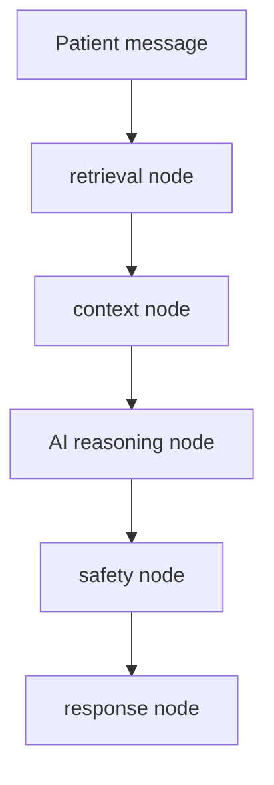

In practice the FastAPI route triggers a workflow run (or a single service call for trivial paths); the workflow engine emits structured events for observability and troubleshooting.

---

## 7) Authentication Flow

DocTalk uses JWT bearer tokens with role claims.

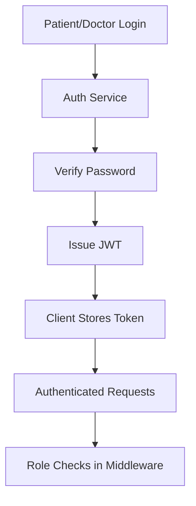

### Auth design

- Passwords are hashed with bcrypt
- JWT tokens carry user identity and role
- Middleware resolves the current user from the bearer token
- Route dependencies enforce patient-only or doctor-only access where required

| Role | Typical access |
|---|---|
| Patient | Own profile, appointments, consultations, uploaded assets |
| Doctor | Own profile, appointments, consultations, shared assets |

---

## 8) Consultation & Messaging Architecture

Consultations are relational threads created from appointments. Messaging is scoped to a consultation, which keeps the communication model simple and auditable.

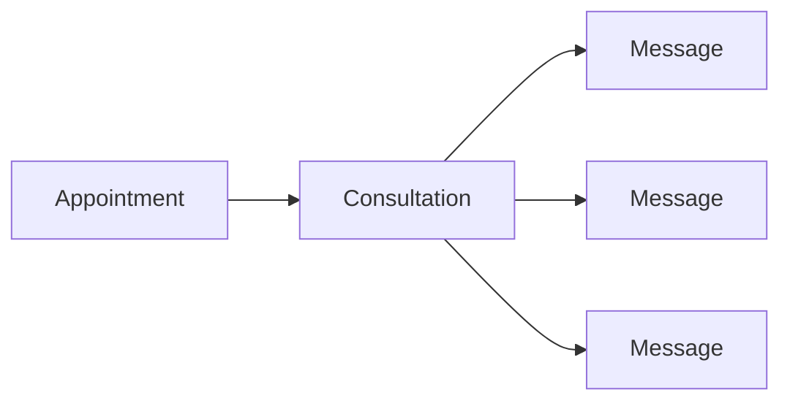

### How it works

- A consultation is created from an existing appointment
- The consultation is linked to a single patient and doctor
- Messages are stored with sender identity and role
- Access is limited to the assigned patient or doctor
- Message history supports pagination

### Why this model works

- Easy to reason about
- Suitable for solo-project scale
- Cleanly upgradeable to notifications, attachments, or future AI summaries

---

## 9) Medical Asset Architecture

Stage 5 introduced a secure file workflow for medical assets.

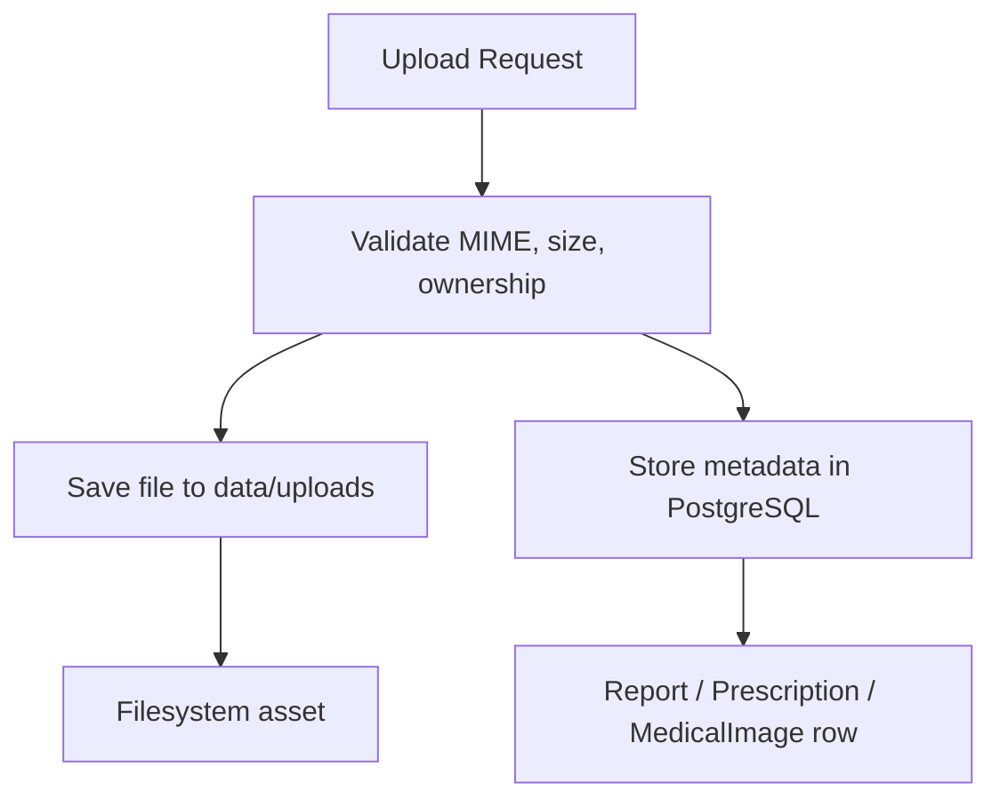

### Asset types

| Asset | Purpose | Typical upload source |
|---|---|---|
| Report | Lab results, scans, clinical PDFs | Patient or doctor |
| Prescription | Prescription documents | Doctor |
| Medical image | X-rays, images, visual diagnostics | Patient or doctor |

### Stored metadata

- patient_id
- uploaded_by
- consultation_id (optional)
- file_type
- original_name
- stored_path
- mime_type
- file_size
- timestamps

### Storage strategy

- Files are stored under `data/uploads`
- PostgreSQL stores only file metadata and relationships
- Download endpoints resolve the file path from metadata
- Delete endpoints remove both the database record and the physical file

> [!IMPORTANT]
> This is a metadata-plus-filesystem architecture, not a blob-in-database design. That keeps it simple and scalable.

## Medical Processing Architecture

The medical processing layer routes extracted content into the local AI stack and (optionally) into the RAG memory via the contextual pipeline.

```mermaid
flowchart LR
    Asset[Medical asset] --> OCR[OCR / parsing]
    OCR --> Normalize[Normalization + Summary]
    Normalize --> Embed[Embedding Service (nomic-embed-text)]
    Embed --> Store[pgvector / rag_documents]
    Normalize --> ContextBuilder[Context Builder]
    ContextBuilder --> AIService[qwen2.5:7b-instruct]
    Image[Medical image] --> Vision[llama3.2-vision]
    Vision --> Findings[Structured findings]
    Findings --> OptIn[Optional RAG ingestion]
```

- OCR/prescription flows produce normalized summaries which are embedded and stored in `rag_documents`.
- X-ray analysis runs via the vision service and may be ingested into RAG if configured.
- All downstream AI reasoning uses the `context_builder_service` to assemble retrieval results before calling `ai_service`.

---

## RAG Architecture

Stage 8 adds a lightweight semantic memory layer on top of the existing medical asset and consultation system.

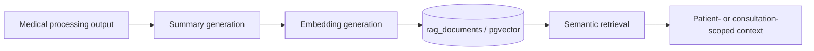

### Why this shape works

- Keeps retrieval separate from the canonical relational record
- Produces compact, normalized medical summaries instead of embedding raw chats or raw OCR text
- Makes retrieval deterministic enough for a solo-project backend while still being AI-ready
- Preserves the original source data in PostgreSQL and the filesystem

> [!NOTE]
> RAG here is a memory layer, not a replacement for consultations, assets, or structured medical records.

### Local-first behavior

- Retrieval is local through PostgreSQL and pgvector
- Embedding generation is local through Ollama
- The result is a retrieval stack that can work without any external AI service

---

## Semantic Medical Memory

Semantic memory stores compact medical summaries with embeddings so the backend can retrieve clinically relevant context later without replaying the full source document.

### Stored memory shape

- `rag_documents.id` — primary key
- `patient_id` — owning patient, required
- `consultation_id` — optional consultation scope
- `source_type` — report, prescription, xray, consultation summary, or manual ingest
- `content` — normalized text used for retrieval
- `summary` — short AI-ready summary
- `embedding` — pgvector vector persisted in PostgreSQL
- `metadata` — JSONB for filtering and traceability

### Why summaries are embedded

- Raw OCR and chat text is noisy, repetitive, and often too large for useful similarity search
- Summaries capture the medically relevant signal in a smaller, more stable representation
- The summary step lets the AI clean up formatting before retrieval while keeping provenance in `metadata`

### Fallback behavior

- If the embedding provider fails, the backend uses a deterministic fallback embedding
- If ingestion cannot produce a safe summary, the service can skip or normalize the record rather than storing malformed memory
- Retrieval still works with the stored vector or fallback vector, but the source metadata remains scoped to the patient

---

## Automatic Medical Ingestion Pipeline

The medical processing service now seeds the memory layer automatically after successful OCR, prescription, or X-ray analysis.

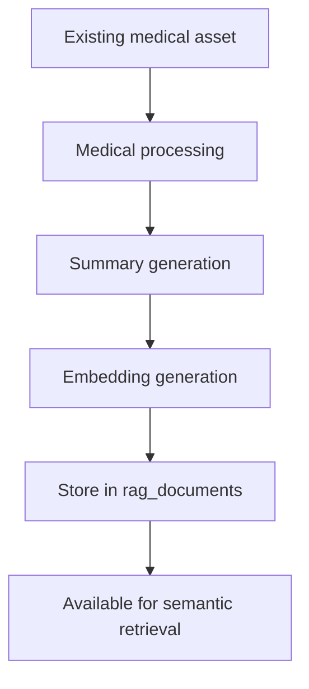

### How automatic ingestion works

1. An existing report, prescription, or X-ray is analyzed by the processing service
2. The service builds a compact summary from the structured result
3. The embedding service converts that summary into a vector
4. The RAG service stores the document in `rag_documents`
5. Duplicate-safe ingestion prevents repeated inserts for the same normalized content

### Why this is useful

- No extra manual indexing step is required after analysis
- The backend gets memory coverage immediately after OCR or model-based parsing completes
- The original asset remains the source of truth; the RAG layer only stores a retrieval-friendly derivative

---

## Workflow Architecture

Stage 10 introduces an explicit, lightweight workflow layer to sequence existing services into named pipelines. Workflows are small, deterministic graphs that call into service methods (not replace them). Each workflow focuses on a single business process (chat handling, report ingestion, x-ray analysis), emits structured events, and exposes run-time observability.

### Why workflows improve maintainability

- **Explicit sequencing:** The order of retrieval, context assembly, reasoning, safety, and storage is documented in the workflow, not hidden in ad-hoc service call chains.
- **Testability:** Each workflow step can be stubbed or replayed for unit and integration tests.
- **Reusability:** The same services are reused across workflows with distinct orchestration, avoiding duplicated logic.

## LangGraph Integration

LangGraph is used as a coordinator only — it defines and runs small graphs of steps that call into the backend services. It does not contain business logic or direct DB access; those remain inside services implemented in Python. LangGraph's role is to:

- Define named workflow graphs (versioned, small, and human-readable).
- Emit lifecycle events (start, step-complete, error, finish) for observability.
- Provide a compact retry and error-handling policy per step.

Why LangGraph is orchestration-only

- Keeps service code authoritative and easy to test.
- Avoids embedding persistence or validation inside orchestration definitions.
- Enables operator-friendly workflow changes without touching core service code.

## Patient Chat Workflow

An example workflow for processing an incoming patient message:

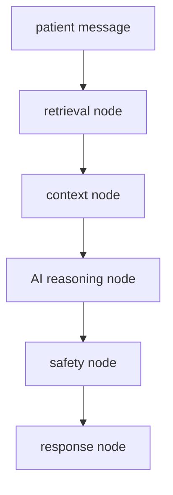

Notes:

- `retrieval node` calls `retrieval_service` (pgvector + metadata filtering).
- `context node` calls `context_builder_service` to assemble a prompt bundle.
- `AI reasoning node` calls `ai_service` (Ollama routing) and returns structured output.
- `safety node` runs policy checks and optional human-in-the-loop gating.
- `response node` persists any new `rag_document` items and returns the final payload.

## Report Processing Workflow

A report upload is commonly processed through an ingestion workflow:

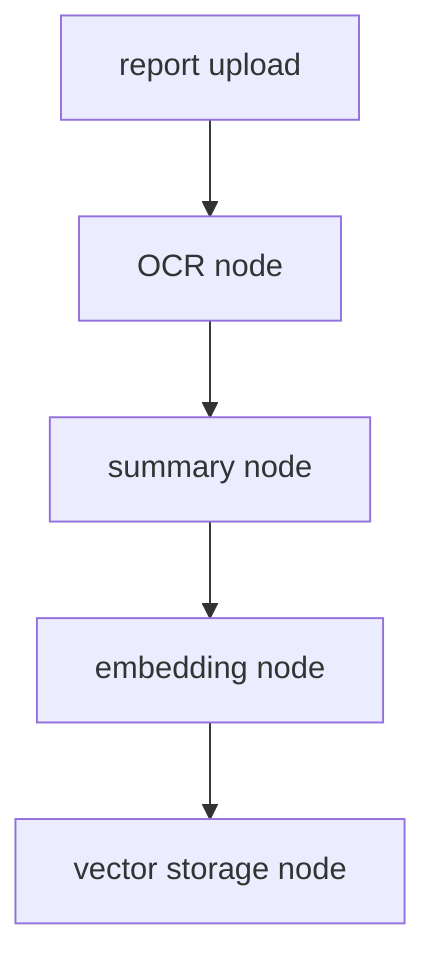

- The OCR node calls `ocr_service` and `prescription_analysis_service` as needed.
- The summary node normalizes and prepares text for embedding.
- The embedding node calls `embedding_service`; store writes to `rag_documents`.

## X-ray Analysis Workflow

Image-based pipelines are separate to avoid model co-residency and to keep vision workloads bounded:

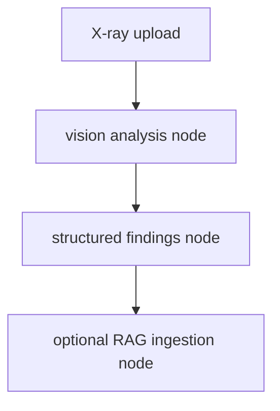

- Vision runs on the `llama3.2-vision` model via the vision service and returns structured findings.
- Findings may be summarized and optionally ingested into RAG depending on configuration.

## Workflow State Management

Workflows maintain minimal run state (step status, timestamps, error payloads, and important IDs) and emit structured events to a lightweight store or log. State is intentionally transient and small:

- `workflow_run.id`, `workflow_name`, `status` (running/succeeded/failed), `current_step`, `started_at`, `finished_at`, `last_error`.
- Services remain responsible for durable state (DB writes, rag_documents, file metadata).

This separation keeps orchestration recoverable and auditable without duplicating business data in the orchestration layer.

## Controlled AI Orchestration

Workflows implement deterministic, auditable orchestration rather than autonomous agents. Design points:

- Steps are limited and explicit; each step maps to a service call with well-defined inputs/outputs.
- Safety nodes run standardized checks and can pause for manual review.
- Retries are configured per-step with bounded backoff and failure policies.
- No autonomous agents: the system avoids open-ended decision loops and keeps human oversight simple.

Why autonomous agents were intentionally avoided

- Agents introduce unpredictable side effects and harder-to-test behaviors for medical data.
- Controlled workflows keep clinical safety, auditability, and regulatory simplicity intact.

## Workflow Observability

Observability focuses on step-level events, execution traces, and concise metrics:

- Emit events: `workflow.start`, `workflow.step.complete`, `workflow.step.error`, `workflow.finish`.
- Capture step latency, success rates, and model load failures.
- Persist small run metadata for troubleshooting; rely on existing logging for full traces.
- Use these signals to alert when embeddings fail, models time out, or safety checks trigger.

How workflows prepare the backend for future assistants

- Workflows make end-to-end behaviors explicit and versionable, providing a safe surface for future assistant components to call into (human-in-the-loop approval, task handoffs, or multi-step assistant flows).
- Because services contain core logic, future assistants can orchestrate higher-level goals by composing stable service calls via workflows without re-implementing business rules.


## Embedding Generation Pipeline

The embedding layer is intentionally small and predictable.

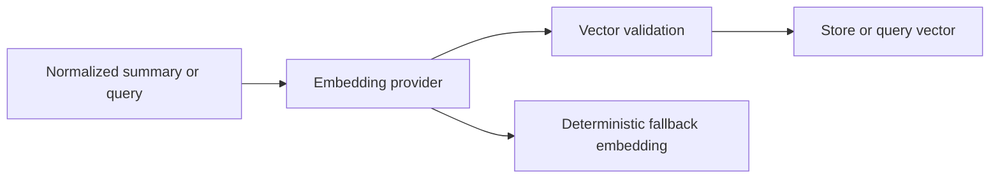

### Design notes

- Provider: `nomic-embed-text` (local Ollama embeddings endpoint).
- Embedding service responsibilities:
    - Validate model availability and vector dimension (expected: 384).
    - Convert normalized summaries and queries into vectors.
    - Return deterministic fallback vectors when the provider fails.
    - Expose a safe `to_vector_literal()` helper for DB insertion/search.

Design note: keep embeddings independent of reasoning so indexing and retrieval are inexpensive and stable.

---

## pgvector Integration

PostgreSQL with pgvector is used as the storage and retrieval engine for semantic memory.

### Why pgvector instead of FAISS

- Keeps relational metadata and vector search in the same database
- Avoids a second persistence system for a small backend
- Makes patient isolation, consultation filtering, and source tracking easier to enforce in SQL
- Fits the existing Prisma-centered architecture without adding a separate index service

### Persistence strategy

- Vectors are stored directly in `rag_documents.embedding`
- Metadata stays in `rag_documents.metadata` as JSONB
- The original normalized text is kept alongside the vector for explainability and fallback retrieval
- The schema stays compact and easy to migrate

> [!TIP]
> For this project, pgvector gives enough retrieval quality without introducing the operational overhead of a separate vector store.

---

## Semantic Retrieval Pipeline

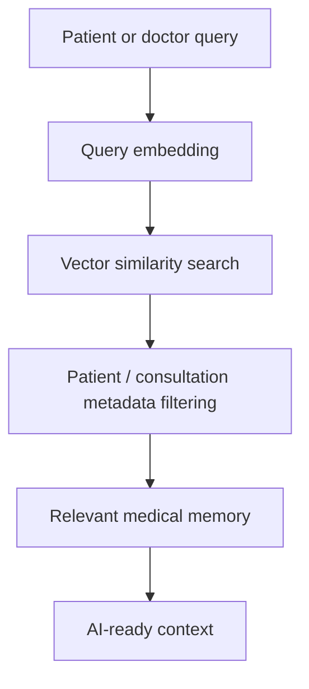

### Retrieval safeguards

- Search is always scoped to the authenticated patient or permitted doctor scope
- Consultation-scoped retrieval only returns rows linked to that consultation when requested
- Metadata filters run alongside vector similarity, not after the fact
- Duplicate documents are skipped during ingestion so repeated analysis does not inflate retrieval noise

### Context assembly

- The retriever returns concise, relevant memory items
- The calling service can feed those items into a later AI prompt or medical workflow
- This keeps generation separate from retrieval and makes the system easier to reason about

---

## Patient Isolation & Metadata Filtering

Healthcare retrieval must never cross patient boundaries, even when two summaries look semantically similar.

### Isolation rules

- Every RAG document belongs to exactly one patient
- Optional consultation scope further narrows access when a workflow is consultation-specific
- Metadata filtering ensures the database only returns documents from the authorized scope
- Service-layer checks prevent a query from escaping its allowed patient or consultation context

### Why metadata filtering is critical

- Semantic similarity alone is not sufficient in healthcare
- Two patients can share similar symptoms, medications, or report language
- Without metadata filtering, a vector search could leak another patient’s memory
- Combining vector search with relational scoping keeps retrieval clinically safe and predictable

---

## Context-Aware Medical Retrieval

The retrieval layer is consultation-aware, which means it can return memory that is relevant to the current visit instead of only the broad patient history.

### Supported scopes

- Patient-wide memory for longitudinal context
- Consultation-specific memory for active visit support
- Source-aware retrieval for reports, prescriptions, X-rays, or consultation summaries

### Practical outcome

- A doctor can search the patient’s memory and see relevant prior medical context
- A patient-scoped lookup can surface medication or report history without exposing another user’s records
- The result set is small enough to be useful in downstream prompts

---

## 10) Database Design Overview

Prisma is the source of truth for backend schema design.

### Core relational entities

| Model | Purpose |
|---|---|
| Patient | Patient identity and clinical profile |
| Doctor | Doctor identity and profile |
| Appointment | Scheduling and medical visit state |
| Consultation | Appointment-linked communication thread |
| Message | Consultation chat message |
| Report | Medical report metadata |
| Prescription | Prescription metadata |
| MedicalImage | X-ray/image metadata |
| RagDocument | Semantic medical memory with pgvector embedding |

### Design notes

- Appointments connect patients and doctors
- Consultations are unique per appointment
- Messages belong to consultations
- Medical asset tables store ownership and optional consultation linkage
- RagDocument stores patient-scoped semantic memory with optional consultation linkage
- Consultation-aware retrieval uses the same relational keys as the rest of the backend
- Data is normalized enough for clarity, but not over-modeled for a solo project

---

## 11) Security Design

Security is built into the backend rather than added as an afterthought.

### Security controls

- JWT authentication for protected requests
- Role-based route gating
- Ownership validation on consultations and file assets
- MIME type and extension validation for uploads
- File size limits for uploaded assets
- Unauthorized access returns `403 Forbidden`
- Patient isolation is enforced at the service layer for RAG queries
- Retrieval uses metadata filtering so semantic search cannot cross patient boundaries
- Consultation-scoped memory is only returned when the consultation relationship is valid

### Access rule summary

| Resource | Who can access |
|---|---|
| Patient profile | The patient, or doctor where explicitly allowed |
| Doctor profile | The doctor |
| Consultation | Assigned patient and doctor only |
| Medical files | Assigned patient or linked doctor |

### File safety model

- Reject missing files
- Reject unsupported file types
- Reject oversized uploads
- Reject uploads for another patient
- Reject downloads from unauthorized users

### RAG safety model

- Reject searches outside the authenticated patient scope
- Reject consultation-scoped searches when the consultation does not belong to the requester
- Skip or normalize malformed embeddings rather than persisting unsafe vectors
- Keep the canonical clinical record separate from semantic memory

---

## 12) API Structure

The API is grouped by domain and intentionally kept shallow.

```text
/api/auth
/api/patient
/api/doctor
/api/appointments
/api/chat
/api/reports
/api/prescriptions
/api/medical_images
 /api/processing
```

### Example endpoint categories

| Domain | Examples |
|---|---|
| Auth | signup, login, profile lookup |
| Appointments | create, approve, cancel, history |
| Chat | create consultation, list consultations, send messages, fetch history |
| Reports | upload, list, metadata, download, delete |
| Prescriptions | upload, list, metadata, download, delete |
| Medical images | upload, list, metadata, download, delete |

---

## 13) Technologies Used

| Technology | Purpose |
|---|---|
| FastAPI | HTTP API framework |
| Prisma | ORM and relational schema management |
| PostgreSQL | Primary persistent data store |
| Docker | Local database environment |
| JWT | Authentication and authorization |
| bcrypt | Password hashing |
| python-multipart | Multipart file uploads |
| Pillow / PyMuPDF | Supporting future document and image workflows |
| Ollama | Local runtime for text, vision, and embeddings models |
| pgvector | Vector storage and semantic search in PostgreSQL |

Embedding vector dimension: 384 (nomic-embed-text default)

---

## 14) Deployment Notes

DocTalk is deployed as a local-first healthcare AI backend rather than a cloud-LLM service.

### Runtime requirements

### Runtime requirements

- PostgreSQL with pgvector enabled
- Ollama running locally with the required models pulled
- Recommended hardware for local inference: GPU (e.g., RTX 4050 6GB) and 16 GB RAM, noting that only one heavy model should be resident at a time for predictable behavior

### Required models

- `qwen2.5:7b-instruct`
- `llama3.2-vision`
- `nomic-embed-text`

### Practical guidance

- Pull models with Ollama before starting the app (`ollama pull <model>`).
- Start PostgreSQL (Docker Compose) before the application so migrations and pgvector are available.
- Prefer short-lived vision runs; run embedding tasks on CPU when possible to avoid GPU pressure.
- Use deterministic fallback behavior for embeddings and safe summaries when a model cannot load.

---

## 15) Future Roadmap

The backend is intentionally structured to support future expansion without rewriting the core system.


### Near-term priorities

- Async background processing for large asset parsing and RAG ingestion
- Better retrieval ranking and summary quality tuning
- Comprehensive monitoring, logging, and alerting for AI endpoints
- Production hardening: secrets management, backups, and rate-limiting

### Longer-term

- LangGraph or workflow orchestrators that consume `context_builder_service` outputs (orchestrated, controlled workflows)
- Controlled agent-like flows with strict step validation and human-in-the-loop approval
- Optional object storage for large files and scalable search indexing

---

## 16) Future LangGraph Integration

LangGraph is intentionally deferred until the retrieval and memory layers are stable. The current Stage 8 design already provides the building blocks LangGraph would need later.

### Intended flow

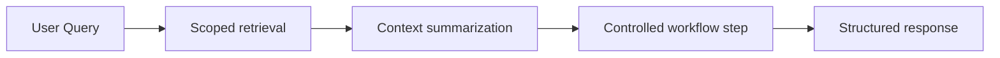

### Planned scope

- Route only after the RAG service has produced a scoped context bundle
- Keep patient-specific retrieval isolated and permission aware
- Use retrieval as an explicit step, not a hidden side effect
- Add controlled branches for follow-up questions or document-specific workflows

> [!NOTE]
> LangGraph should orchestrate the existing service boundaries, not replace them.

## 17) Development Philosophy

DocTalk follows a simple and professional development philosophy:

- Keep the backend understandable at a glance
- Prefer explicit relational data over hidden state
- Write services that can be tested independently
- Avoid unnecessary abstraction until it proves useful
- Build future AI capability on top of a stable clinical foundation

This keeps the project realistic, reviewable, and easy to extend.

---

## 18) Scalability Considerations

The current backend is designed for solo-project scale, but it remains scalable in the right ways.

### What already scales well

- Relational schema with Prisma
- File storage separated from metadata
- Clear service boundaries
- Easy route extension by domain
- Consultation-linked communication model

### What can be improved later

- Background jobs for file parsing
- Object storage instead of local disk
- Search indexing for documents
- Async AI workflows
- Audit trails and event logs

---

## 19) Future Production Improvements

Before production use, the backend would benefit from:

- Object storage for medical files
- Virus scanning for uploads
- Comprehensive audit logging
- Rate limiting on public endpoints
- Background job queue for OCR and parsing
- Structured observability and tracing
- Backups and disaster recovery strategy
- Environment-specific secrets management

> [!TIP]
> None of these are required to make the current backend understandable or reviewable. They are natural production hardening steps for a later phase.

---

## Startup Instructions

### Local development

```powershell
cd D:\DocTalk
.\.venv\Scripts\Activate.ps1
python -m uvicorn backend.main:app --reload --host 127.0.0.1 --port 8000
```

### Prisma commands

```powershell
npx prisma generate
npx prisma db push
```

### Docker database commands

```powershell
docker compose up -d
docker compose logs -f
```

### Development workflow

1. Update schema or backend services
2. Run `npx prisma generate`
3. Run `npx prisma db push`
4. Start FastAPI locally
5. Validate the affected route with a small smoke test
6. Confirm role-based access and data persistence

---

## Summary

DocTalk’s backend is now a clean relational healthcare foundation with:

- secure authentication
- appointment and consultation workflows
- secure messaging
- robust medical asset management
- Prisma-backed metadata storage
- filesystem-based binary storage
- a practical path to future AI integration

It is intentionally simple, professional, and well-positioned for OCR, RAG, and agentic features in later phases.