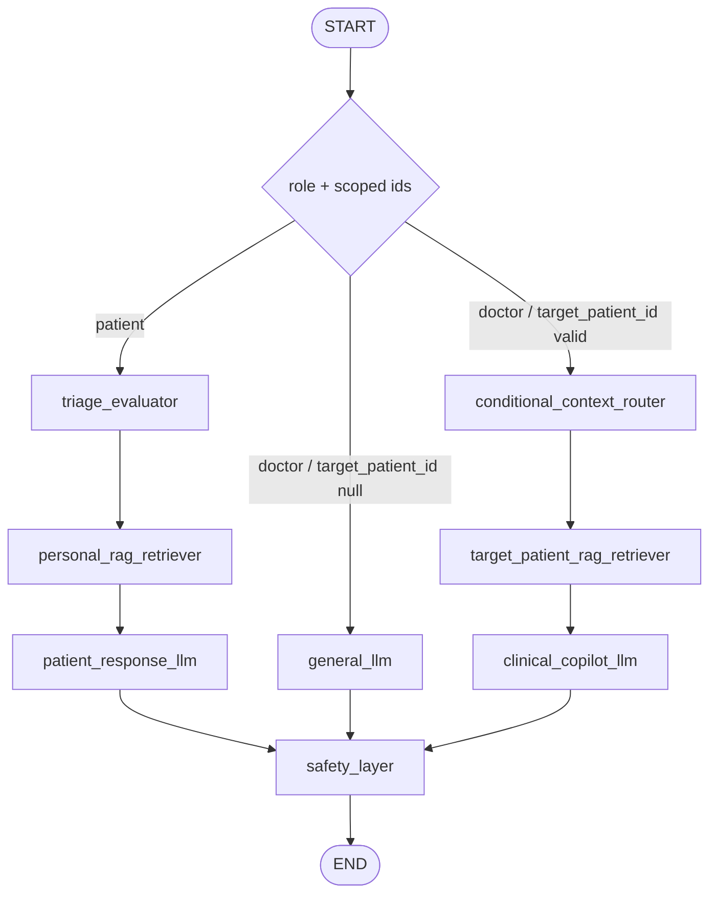

# Human-to-AI LangGraph Workflow Blueprint

This document is the architectural contract for the Human-to-AI assistant workflow. It enforces strict isolation between patient and doctor dashboards and removes any dependency on telemedicine consultation identifiers.

## 1. Segregated Session Scopes

The workflow must treat Patient AI and Doctor AI as distinct session models with separate state boundaries, retrieval namespaces, and routing assumptions.

### Patient AI Workspace

- Completely decoupled from consultation IDs.
- The session identifier is strictly the authenticated Patient's `user_id`.
- The vector namespace is hardlocked to this `user_id` so no cross-patient or cross-role state can leak into the patient workspace.

### Doctor AI Workspace

- Tracked via the Doctor's `user_id`.
- Supports an optional context toggle property: `target_patient_id`.
- If `target_patient_id` is null, the workspace remains in general medical chat mode.
- If `target_patient_id` is valid, the context layer must fetch report and x-ray RAG data associated only with that specific patient.

## 2. Refactored Graph State (`WorkflowState`)

The graph state must be minimal, explicit, and role-aware so each execution is isolated by authenticated user scope.

```python
from typing import Any, Literal, TypedDict

from langchain_core.messages import BaseMessage


class WorkflowState(TypedDict):
    messages: list[BaseMessage]
    role: Literal["patient", "doctor"]
    user_id: str
    target_patient_id: str | None
    context_payload: dict[str, Any]
```

State semantics:

- `messages`: List of LangChain message objects.
- `role`: Literal["patient", "doctor"].
- `user_id`: String identifying the active user chatting with the AI.
- `target_patient_id`: Optional string identifying the selected patient profile for doctor-scoped analysis.
- `context_payload`: Dictionary containing documents fetched during execution.

Implementation constraints:

- The state must not include `consultation_id`.
- Any persisted or in-memory namespace key must be derived from `user_id` and, when applicable, `target_patient_id`.
- The context payload must remain execution-local and must not be reused across roles.

## 3. Parallel Implementation Roadmap

The implementation must be split into two non-overlapping execution paths so the patient and doctor dashboards can evolve independently without shared-session leakage.

### Patient Path

`triage_evaluator` -> `personal_rag_retriever` -> `patient_response_llm` -> `safety_layer` -> END

Execution rules:

- `triage_evaluator` runs first and can enrich the request before retrieval.
- `personal_rag_retriever` only queries the authenticated patient's namespace.
- `patient_response_llm` must respond in patient-friendly language and stay aligned to the retrieved personal context.
- `safety_layer` is the final gate before the graph ends.

### Doctor Path

`conditional_context_router` -> (If null: `general_llm` | If present: `target_patient_rag_retriever` -> `clinical_copilot_llm`) -> `safety_layer` -> END

Execution rules:

- `conditional_context_router` inspects `target_patient_id` and selects the correct branch.
- When `target_patient_id` is null, `general_llm` handles a general medical chat with no patient-specific retrieval.
- When `target_patient_id` is present, `target_patient_rag_retriever` fetches only that patient's report and x-ray context before generation.
- `clinical_copilot_llm` produces doctor-facing clinical assistance from the selected patient context.
- `safety_layer` must always execute before END.

### Isolation Requirements

- Patient execution must never read doctor-scoped context.
- Doctor execution must never use patient-session namespace keys.
- No graph node may infer a consultation identifier as a substitute for authenticated user scope.
- All context retrieval must be keyed by role-appropriate user identity before generation begins.

## 4. Routing Contract

The graph must route exclusively from role and scoped identifiers.

1. `START` -> role-aware entry node.
2. If `role == "patient"`, execute the Patient Path.
3. If `role == "doctor"`, execute the Doctor Path.
4. Every path must terminate at `safety_layer` before `END`.

Implementation note:

- The entry node may validate `user_id` and `target_patient_id`, but it must not reintroduce consultation-based branching.
- The router should remain a pure decision node and must not mutate response content.

## 5. Workflow Diagram



## 6. Architectural Guarantees

- Patient and doctor sessions are isolated by authenticated `user_id`, not by consultation records.
- Doctor-scoped analysis is opt-in through `target_patient_id` and must never default to another patient's context.
- Retrieval namespaces, graph state, and downstream generation nodes must preserve role boundaries end to end.