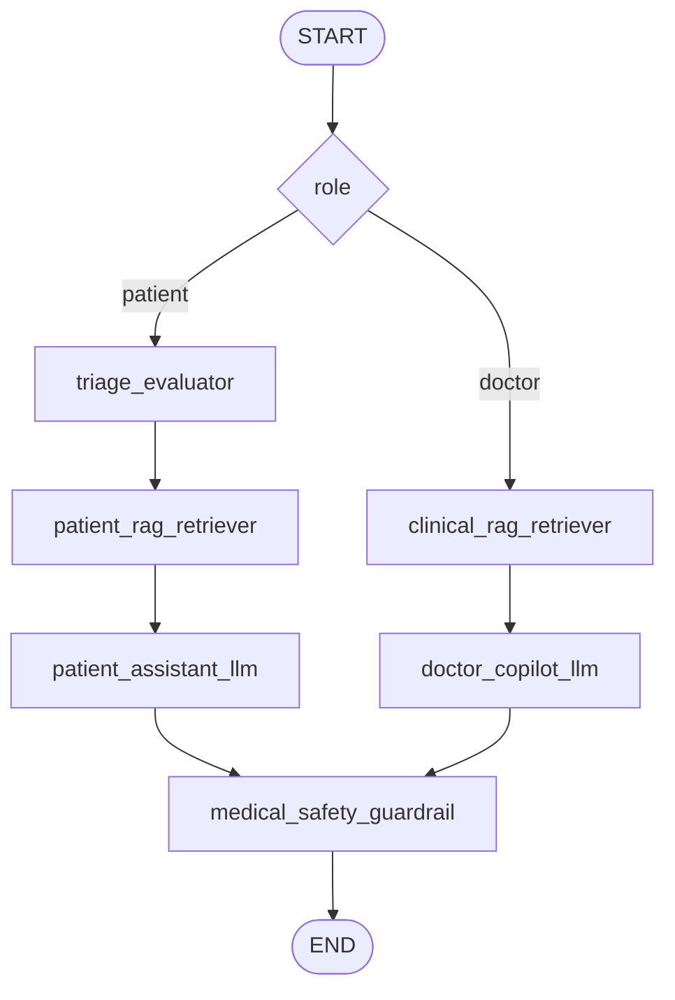

# Human-to-AI LangGraph Workflow Blueprint

This document is the strict contract for the Human-to-AI assistant workflow. It defines the shared graph state, the node responsibilities, the routing order, and the streaming model used by FastAPI.

## 1. Unified Graph State (`WorkflowState`)

The workflow must use a single `TypedDict` state object so every node reads and writes the same contract.

```python
from typing import Any, Literal, TypedDict

from langchain_core.messages import BaseMessage


class WorkflowState(TypedDict):
    messages: list[BaseMessage]
    role: Literal["patient", "doctor"]
    consultation_id: str
    triage_level: str  # initialize as "routine" at graph entry
    context_payload: dict[str, Any]
    final_response: str
```

State semantics:

- `messages`: the full message history for the current consultation turn.
- `role`: selects the downstream assistant persona and response style.
- `consultation_id`: binds the workflow to the active consultation record.
- `triage_level`: risk label for patient-facing routing; default should be `"routine"`.
- `context_payload`: structured enrichment bucket for RAG outputs, extracted file text, and intermediate metadata.
- `final_response`: the final text that is emitted to the client after guardrail review.

## 2. Node Definitions (The Agents)

The graph is organized around one router, two role-specific paths, and one shared safety node.

**The Router:** `route_by_role`

- Evaluates `role` and selects the correct path before any generation begins.
- Keeps the Human-to-AI workflow separate from any Human-to-Human messaging flow.
- Must not mutate the response content; it only decides the branch.

**Patient AI Assistant Path**

- `triage_evaluator`: scans the latest patient message for emergency signals such as `chest pain` and updates `triage_level` accordingly.
- `patient_rag_retriever`: fetches simplified explanations of the patient’s own uploaded reports from pgvector and stores them in `context_payload`.
- `patient_assistant_llm`: drafts empathetic, plain-language guidance for the patient using the triage state and retrieved context.

**Doctor AI Copilot Path**

- `clinical_rag_retriever`: fetches dense clinical context from patient records, including structured summaries and reference material from pgvector.
- `doctor_copilot_llm`: drafts clinical summaries, possible ICD codes, and note-ready medical documentation for the doctor.

**Shared Node**

- `medical_safety_guardrail`: reviews the drafted response and blocks definitive medical diagnosing, unsafe certainty, or policy violations. If the output violates safety policy, it must override the response with a safer alternative.

## 3. Dynamic Routing (Conditional Edges)

The graph must follow this exact traversal order:

1. `START` -> `route_by_role`.
2. If `role == "patient"`: route to `triage_evaluator` -> `patient_rag_retriever` -> `patient_assistant_llm` -> `medical_safety_guardrail`.
3. If `role == "doctor"`: route to `clinical_rag_retriever` -> `doctor_copilot_llm` -> `medical_safety_guardrail`.
4. `medical_safety_guardrail` -> `END`.

Implementation note:

- `route_by_role` should be implemented as a conditional edge from `START`.
- The patient path must always run triage before retrieval so emergency language can influence retrieval depth and tone.
- The doctor path skips triage because it is a clinician-facing workflow.

## 4. WebSocket Streaming Integration

FastAPI should expose a WebSocket endpoint for the Human-to-AI assistant so the client can receive partial model output in real time.

The integration pattern is:

1. The WebSocket receives the user message, `role`, and `consultation_id`.
2. The backend constructs a `WorkflowState` payload and starts the LangGraph execution.
3. Instead of waiting for the full graph result, the server iterates over LangGraph `.astream_events()`.
4. Token and event chunks are forwarded to the browser as they arrive.
5. The client renders streamed text incrementally and then replaces it with the final message when the graph finishes.

Streaming expectations:

- Use `.astream_events()` to capture node starts, node completions, and token-level model events.
- Preserve the same `consultation_id` across the stream so the client can correlate the response with the active chat session.
- Send a final completion event containing `final_response` after `medical_safety_guardrail` finishes.
- If a node fails, emit an error event over the WebSocket and stop streaming that turn.

Recommended event shape:

```json
{
  "type": "token | node_start | node_end | final | error",
  "node": "patient_assistant_llm",
  "consultation_id": "...",
  "content": "..."
}
```

The WebSocket layer should remain transport-only. All branching, retrieval, triage, generation, and safety enforcement must stay inside the LangGraph workflow so the client always observes a single coherent assistant stream.

## 5. Workflow Diagram

